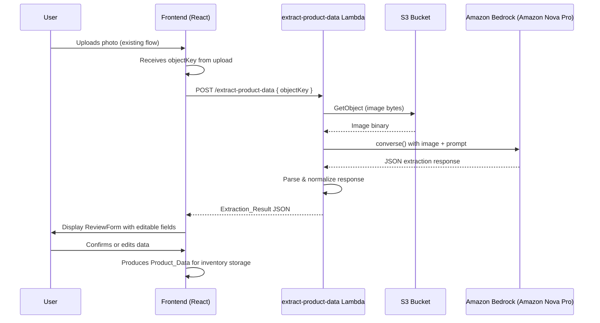

# Design Document: AI Data Extraction

## Overview

The AI Data Extraction module adds automated product data extraction to PantryVision using Amazon Bedrock's **Amazon Nova Pro** vision model (`amazon.nova-pro-v1:0`). After a user uploads a product photo via the existing `upload-product-photo` Lambda, the frontend calls a new `extract-product-data` Lambda endpoint. This Lambda retrieves the image from S3, sends it to Amazon Nova Pro via the Bedrock Converse API, parses the structured JSON response, and returns an `Extraction_Result` to the frontend. The frontend then displays the extracted data in a `ReviewForm` component where the user can confirm or manually correct fields before saving to inventory.

Amazon Nova Pro was chosen for fast response times and low per-invocation cost, while providing strong vision capabilities for product label reading.

## Architecture



### Infrastructure Components

| Component | Resource | Purpose |
|-----------|----------|---------|
| Lambda | `extract-product-data` | Orchestrates S3 retrieval, Bedrock invocation, response parsing |
| S3 Bucket | `pantryvision-product-images` | Stores uploaded product photos (already exists) |
| Bedrock Model | `amazon.nova-pro-v1:0` | Vision model for extracting text/data from product images |
| API Gateway | New endpoint `/extract-product-data` | REST endpoint for extraction requests |
| IAM Role | `extract-product-data-execution-role` | Permissions for S3, Bedrock, CloudWatch |

## Components and Interfaces

### Backend: `extract-product-data` Lambda

**Runtime:** Python 3.12  
**Handler:** `handler.lambda_handler`  
**Timeout:** 60 seconds  
**Memory:** 256 MB (image processing requires more than the upload Lambda's 128 MB)

#### Entry Point

```python
def lambda_handler(event, context) -> dict:
    """
    POST /extract-product-data
    Body: { "objectKey": "<uuid>.<ext>" }
    Returns: Extraction_Result or error response
    """
```

#### Internal Functions

| Function | Responsibility |
|----------|---------------|
| `validate_request(body)` | Validates objectKey presence and format (UUID + image extension) |
| `retrieve_image(object_key)` | Downloads image from S3, returns bytes and content type |
| `invoke_bedrock(image_bytes, image_format)` | Calls Amazon Nova Pro via Converse API, returns raw text response |
| `parse_extraction(raw_response)` | Parses JSON from model output, normalizes dates, handles partial results |
| `build_success_response(extraction)` | Constructs HTTP 200 response with Extraction_Result |
| `build_error_response(status, code, message)` | Constructs error HTTP response |

#### Bedrock Invocation (Converse API)

```python
import boto3
import time

bedrock_runtime = boto3.client("bedrock-runtime", region_name=os.environ.get("AWS_REGION"))

def invoke_bedrock(image_bytes: bytes, image_format: str) -> str:
    """
    Invokes Amazon Nova Pro via the Bedrock Converse API with the product image.
    Returns the model's text response containing extracted product JSON.
    """
    model_id = os.environ.get("BEDROCK_MODEL_ID", "amazon.nova-pro-v1:0")

    start_time = time.time()

    response = bedrock_runtime.converse(
        modelId=model_id,
        messages=[{
            "role": "user",
            "content": [
                {
                    "image": {
                        "format": image_format,  # "jpeg", "png", or "webp"
                        "source": {
                            "bytes": image_bytes
                        }
                    }
                },
                {
                    "text": EXTRACTION_PROMPT
                }
            ]
        }],
        inferenceConfig={
            "maxTokens": 1024,
            "temperature": 0
        }
    )

    duration_ms = int((time.time() - start_time) * 1000)
    input_tokens = response["usage"]["inputTokens"]
    output_tokens = response["usage"]["outputTokens"]

    logger.info(
        "Bedrock invocation: model=%s duration=%dms input_tokens=%d output_tokens=%d",
        model_id, duration_ms, input_tokens, output_tokens
    )

    return response["output"]["message"]["content"][0]["text"]
```

#### Bedrock Request Payload (Converse API format)

```json
{
  "modelId": "amazon.nova-pro-v1:0",
  "messages": [
    {
      "role": "user",
      "content": [
        {
          "image": {
            "format": "jpeg",
            "source": {
              "bytes": "<raw-image-bytes>"
            }
          }
        },
        {
          "text": "<extraction-prompt>"
        }
      ]
    }
  ],
  "inferenceConfig": {
    "maxTokens": 1024,
    "temperature": 0
  }
}
```

#### Bedrock Expected Response Structure (Converse API)

```json
{
  "output": {
    "message": {
      "role": "assistant",
      "content": [
        {
          "text": "{\"productName\": \"...\", \"brand\": \"...\", \"presentation\": \"...\", \"expirationDate\": \"2025-03-15\", \"confidence\": {\"productName\": \"high\", \"brand\": \"high\", \"presentation\": \"medium\", \"expirationDate\": \"low\"}}"
        }
      ]
    }
  },
  "usage": {
    "inputTokens": 1200,
    "outputTokens": 85
  },
  "stopReason": "end_turn"
}
```

#### Extraction Prompt

```python
EXTRACTION_PROMPT = """Analyze this product image and extract the following information. 
Return ONLY a valid JSON object with these fields:

{
  "productName": "the product name as shown on packaging",
  "brand": "the manufacturer or brand name",
  "presentation": "the product format or size (e.g., '500ml', '1kg', '6 pack')",
  "expirationDate": "the expiration or best-before date in YYYY-MM-DD format",
  "confidence": {
    "productName": "high|medium|low",
    "brand": "high|medium|low",
    "presentation": "high|medium|low",
    "expirationDate": "high|medium|low"
  }
}

Rules:
- If you cannot determine a field, set its value to null and its confidence to "low"
- For expirationDate, convert any date format found to YYYY-MM-DD
- Confidence levels: "high" = clearly visible and readable, "medium" = partially visible or inferred, "low" = not found or guessed
- Return ONLY the JSON object, no additional text or markdown formatting
"""
```

### Frontend: `ReviewForm` Component

**Location:** `frontend/src/components/ReviewForm/ReviewForm.tsx`

#### Props Interface

```typescript
export interface ExtractionResult {
  productName: string | null;
  brand: string | null;
  presentation: string | null;
  expirationDate: string | null; // ISO 8601 YYYY-MM-DD
  confidence: {
    productName: 'high' | 'medium' | 'low';
    brand: 'high' | 'medium' | 'low';
    presentation: 'high' | 'medium' | 'low';
    expirationDate: 'high' | 'medium' | 'low';
  };
}

export interface ProductData {
  productName: string;
  brand: string;
  presentation: string;
  expirationDate: string;
}

export interface ReviewFormProps {
  extractionResult: ExtractionResult;
  onConfirm: (data: ProductData) => void;
  onCancel: () => void;
}
```

#### Behavior

- Each field is displayed in an editable input, pre-filled with the extracted value (or empty if null)
- Fields with `confidence: "low"` are visually highlighted (e.g., amber border + warning icon)
- The user can edit any field regardless of confidence
- Submit validates that `productName` is non-empty
- On valid submit, produces a `ProductData` object via the `onConfirm` callback

### Frontend: `extractionService.ts`

**Location:** `frontend/src/components/ReviewForm/extractionService.ts`

```typescript
export async function requestExtraction(objectKey: string): Promise<ExtractionResult> {
  const apiEndpoint = import.meta.env.VITE_API_ENDPOINT;
  const response = await fetch(`${apiEndpoint}/extract-product-data`, {
    method: 'POST',
    headers: { 'Content-Type': 'application/json' },
    body: JSON.stringify({ objectKey }),
  });

  if (!response.ok) {
    const errorBody = await response.json().catch(() => ({}));
    throw new ExtractionServiceError(errorBody.error || 'UNKNOWN', errorBody.message);
  }

  return response.json();
}
```

## Data Models

### Extraction_Result (API Response)

```json
{
  "productName": "Coca-Cola Original",
  "brand": "Coca-Cola",
  "presentation": "600ml",
  "expirationDate": "2025-08-15",
  "confidence": {
    "productName": "high",
    "brand": "high",
    "presentation": "high",
    "expirationDate": "medium"
  }
}
```

### Error Response

```json
{
  "error": "IMAGE_NOT_FOUND | MISSING_PARAMS | INVALID_OBJECT_KEY | INTERNAL_ERROR",
  "message": "Human-readable description"
}
```

### S3 Object Key Format

Pattern: `<uuid>.<extension>`  
Regex validation: `^[0-9a-f]{8}-[0-9a-f]{4}-[0-9a-f]{4}-[0-9a-f]{4}-[0-9a-f]{12}\.(jpg|jpeg|png|webp)$`

### Environment Variables

| Variable | Default | Description |
|----------|---------|-------------|
| `BUCKET_NAME` | `pantryvision-product-images` | S3 bucket for product images |
| `BEDROCK_MODEL_ID` | `amazon.nova-pro-v1:0` | Bedrock model identifier |
| `BEDROCK_TIMEOUT` | `30` | Timeout in seconds for Bedrock invocation |
| `AWS_REGION` | (from Lambda runtime) | AWS region for service clients |

### IAM Permissions (extract-product-data-execution-role)

```yaml
Policies:
  - PolicyName: s3-read-policy
    PolicyDocument:
      Statement:
        - Effect: Allow
          Action:
            - s3:GetObject
          Resource: !Sub "arn:aws:s3:::${BucketName}/*"
  - PolicyName: bedrock-converse-policy
    PolicyDocument:
      Statement:
        - Effect: Allow
          Action:
            - bedrock:Converse
          Resource: !Sub "arn:aws:bedrock:${AWS::Region}::foundation-model/amazon.nova-pro-v1:0"
ManagedPolicyArns:
  - arn:aws:iam::aws:policy/service-role/AWSLambdaBasicExecutionRole
```

## Correctness Properties

*A property is a characteristic or behavior that should hold true across all valid executions of a system — essentially, a formal statement about what the system should do. Properties serve as the bridge between human-readable specifications and machine-verifiable correctness guarantees.*

### Property 1: Object key validation round trip

*For any* string, if it matches the UUID-extension pattern (`^[0-9a-f]{8}-...\.{jpg|jpeg|png|webp}$`), the `validate_request` function SHALL accept it; if it does not match, the function SHALL reject it with `INVALID_OBJECT_KEY`.

**Validates: Requirements 7.1, 7.2**

### Property 2: Date normalization idempotence

*For any* valid ISO 8601 date string (YYYY-MM-DD), normalizing it SHALL return the same string unchanged.

**Validates: Requirements 2.2**

### Property 3: Null field handling preserves structure

*For any* Bedrock response where N fields (0 <= N <= 4) are null, the parsed Extraction_Result SHALL contain exactly those N fields as null with confidence "low", and the remaining fields SHALL retain their extracted values and confidence levels.

**Validates: Requirements 2.3, 3.3**

### Property 4: Extraction result schema completeness

*For any* successful extraction, the returned Extraction_Result SHALL contain exactly four data fields (productName, brand, presentation, expirationDate) and a confidence object with exactly four indicators.

**Validates: Requirements 2.1, 2.4**

### Property 5: Bedrock failure produces all-null result

*For any* Bedrock error (timeout, model error, invalid response), the Lambda SHALL return a response with all four fields set to null and all four confidence indicators set to "low".

**Validates: Requirements 3.1**

### Property 6: ReviewForm productName validation

*For any* string composed entirely of whitespace (or empty), the ReviewForm SHALL reject submission. *For any* string with at least one non-whitespace character as productName, the ReviewForm SHALL allow submission.

**Validates: Requirements 4.4**

### Property 7: ReviewForm preserves user edits

*For any* ExtractionResult and any set of user edits to the form fields, the produced ProductData SHALL contain exactly the user-edited values (not the original extracted values).

**Validates: Requirements 4.3, 4.5**

## Error Handling

### Backend Error Strategy

| Scenario | HTTP Status | Error Code | Behavior |
|----------|-------------|------------|----------|
| Missing `objectKey` in request | 400 | `MISSING_PARAMS` | Return immediately with descriptive message |
| Invalid object key format | 400 | `INVALID_OBJECT_KEY` | Return immediately, log warning |
| Image not found in S3 | 404 | `IMAGE_NOT_FOUND` | Return with descriptive message |
| Bedrock timeout (>30s) | 200 | N/A | Return all-null result with confidence "low" + error message field |
| Bedrock model error | 200 | N/A | Return all-null result with confidence "low" + error message field |
| Bedrock returns unparseable response | 200 | N/A | Return all-null result with confidence "low" + error message field |
| Unexpected exception | 500 | `INTERNAL_ERROR` | Log full error, return generic message (no internal details) |

Key design decision: Bedrock failures return HTTP 200 with all-null fields rather than an error status code. This allows the frontend to always show the ReviewForm (with empty fields for manual entry) rather than requiring separate error handling paths. This aligns with the architecture rule: **AI is never a blocking requirement**.

### Frontend Error Strategy

- Network errors on the extraction call: Show error message with retry option
- All-null extraction result: Show ReviewForm with empty fields (user enters manually)
- Partial extraction: Show ReviewForm with available fields pre-filled, highlight null fields
- The `ReviewForm` component always renders regardless of extraction success/failure

## Testing Strategy

### Unit Tests (Backend - Python)

- `validate_request`: Test valid/invalid object keys, missing params
- `parse_extraction`: Test well-formed JSON, malformed JSON, partial fields, date normalization
- `build_success_response` / `build_error_response`: Test response structure and CORS headers
- `invoke_bedrock`: Mock `bedrock_runtime.converse()`, test timeout handling, error propagation

### Unit Tests (Frontend - TypeScript/Vitest)

- `ReviewForm`: Render with various ExtractionResult inputs, verify field population, confidence highlighting, validation, and submit behavior
- `extractionService`: Mock fetch, test success/error paths

### Property-Based Tests (fast-check)

The frontend already uses `fast-check` (v3.23.2). Property tests will validate:

- **Object key validation** (Property 1): Generate random strings, verify accept/reject matches regex
- **Date normalization** (Property 2): Generate valid ISO dates, verify idempotence
- **Null field handling** (Property 3): Generate responses with random null combinations, verify structure
- **Schema completeness** (Property 4): Generate valid extractions, verify field count
- **Bedrock failure handling** (Property 5): Generate various error types, verify all-null output
- **ProductName validation** (Property 6): Generate whitespace-only and valid strings, verify form behavior
- **User edit preservation** (Property 7): Generate extraction results + random edits, verify output

Each property test will run a minimum of 100 iterations and be tagged with:
```
// Feature: ai-data-extraction, Property N: <property text>
```

### Integration Tests

- End-to-end: Upload image -> extract -> review -> confirm (with real S3, mocked Bedrock)
- API Gateway: Verify CORS headers, request routing, IAM authorization

### Key Design Decisions

| Decision | Rationale |
|----------|-----------|
| **Amazon Nova Pro** (`amazon.nova-pro-v1:0`) as default model | Fast response times and low cost, while providing strong vision capabilities for product label extraction. Configurable via `BEDROCK_MODEL_ID` env var. |
| **Bedrock Converse API** (not InvokeModel) | The Converse API provides a unified interface across models, making it easy to swap models via env var without code changes. Also provides structured token usage in the response. |
| **HTTP 200 for AI failures** | Ensures the frontend always shows ReviewForm for manual entry. AI never blocks the user flow. |
| **Separate Lambda** (not extending upload Lambda) | Single responsibility. Upload Lambda generates presigned URLs (fast, 10s timeout). Extract Lambda calls Bedrock (slow, 60s timeout). Different IAM permissions needed. |
| **Temperature 0** | Deterministic extraction — we want consistent structured output, not creative responses. |
| **maxTokens 1024** | Extraction output is small JSON (~100-200 tokens). 1024 provides margin without excessive cost. |
| **256 MB Lambda memory** | Image bytes must be held in memory during the Bedrock call. 256 MB handles images up to 5 MB comfortably. |
| **Configurable model ID** | Allows switching to a different model without redeploying code. |
