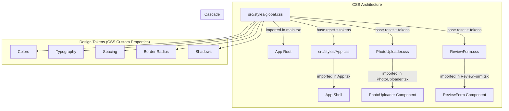

# Design Document: Frontend UI Redesign

## Overview

This design defines the visual layer for PantryVision's frontend, transforming the existing unstyled React application into a production-ready, professional UI suitable for a hackathon demo. The redesign is **CSS-only** — no component logic, state management, or functionality changes. All existing `data-testid` attributes, aria attributes, event handlers, and state transitions remain untouched.

The approach uses a global CSS design system with custom properties (design tokens) and component-specific CSS files co-located with their React components. No external CSS frameworks, CSS-in-JS libraries, or npm dependencies are introduced.

### Design Decisions

| Decision | Rationale |
|----------|-----------|
| Plain CSS with custom properties | Keeps the build simple (Vite handles CSS imports natively), no new dependencies, full browser support |
| Single `global.css` for tokens + reset | Centralized source of truth for colors, spacing, typography; easy to adjust the entire theme in one place |
| Component-specific CSS files | Co-location keeps styles discoverable; avoids monolithic CSS files; mirrors component architecture |
| Mobile-first responsive approach | Target audience manages pantry from phones; progressive enhancement for larger screens |
| AWS-inspired color palette (#232F3E, #FF9900) | Aligns with Amazon/AWS branding for the hackathon context |
| No CSS modules or scoping | BEM-style class naming (already present in components) provides sufficient scoping for a small app |

## Architecture



### File Structure

```
frontend/src/
├── styles/
│   ├── global.css              ← Design tokens, reset, base typography, utility classes
│   └── App.css                 ← App shell layout, header, sections, states
├── components/
│   ├── PhotoUploader/
│   │   ├── PhotoUploader.css   ← Upload zone, preview, progress bar, drag-and-drop
│   │   ├── PhotoUploader.tsx   ← (existing, unchanged logic)
│   │   └── ...
│   └── ReviewForm/
│       ├── ReviewForm.css      ← Card, inputs, confidence badges, form actions
│       ├── ReviewForm.tsx      ← (existing, unchanged logic)
│       └── ...
└── main.tsx                    ← imports global.css
```

### Import Order

1. `main.tsx` imports `../styles/global.css` (design tokens apply globally via `:root`)
2. `App.tsx` imports `../styles/App.css` (layout for app shell)
3. `PhotoUploader.tsx` imports `./PhotoUploader.css` (component-specific)
4. `ReviewForm.tsx` imports `./ReviewForm.css` (component-specific)

## Components and Interfaces

### 1. global.css — Design System Foundation

**Responsibilities:**
- CSS custom properties (design tokens) on `:root`
- Minimal CSS reset (box-sizing, margin removal, font inheritance)
- Base typography (body font, heading scale)
- Shared utility classes (`.btn`, `.btn--primary`, `.btn--secondary`, `.btn--disabled`, `.card`, `.input`)
- CSS keyframe animations (spinner)

**Design Tokens:**

```css
:root {
  /* Colors - AWS-inspired */
  --color-primary: #232F3E;
  --color-accent: #FF9900;
  --color-accent-hover: #EC7211;
  --color-white: #FFFFFF;
  --color-gray-50: #F9FAFB;
  --color-gray-100: #F3F4F6;
  --color-gray-200: #E5E7EB;
  --color-gray-300: #D1D5DB;
  --color-gray-500: #6B7280;
  --color-gray-700: #374151;
  --color-gray-900: #111827;
  --color-success: #059669;
  --color-success-bg: #ECFDF5;
  --color-warning: #D97706;
  --color-warning-bg: #FFFBEB;
  --color-error: #DC2626;
  --color-error-bg: #FEF2F2;

  /* Typography */
  --font-family: 'Inter', -apple-system, BlinkMacSystemFont, sans-serif;
  --font-size-sm: 0.875rem;
  --font-size-base: 1rem;
  --font-size-lg: 1.125rem;
  --font-size-xl: 1.25rem;
  --font-size-2xl: 1.5rem;
  --font-size-3xl: 2rem;

  /* Spacing */
  --space-1: 4px;
  --space-2: 8px;
  --space-3: 12px;
  --space-4: 16px;
  --space-6: 24px;
  --space-8: 32px;
  --space-12: 48px;

  /* Border radius */
  --radius-sm: 4px;
  --radius-md: 8px;
  --radius-lg: 12px;
  --radius-full: 9999px;

  /* Shadows */
  --shadow-sm: 0 1px 2px rgba(0, 0, 0, 0.05);
  --shadow-md: 0 4px 6px -1px rgba(0, 0, 0, 0.1);
  --shadow-lg: 0 10px 15px -3px rgba(0, 0, 0, 0.1);
}
```

**Shared Button Styles:**
- `.btn` — Base: padding, border-radius, font-size, cursor pointer, transition
- `.btn--primary` — Background: `--color-accent`, color: white, hover: `--color-accent-hover`
- `.btn--secondary` — Background: transparent, border: 1px solid `--color-gray-300`, hover: `--color-gray-100` background
- `.btn:disabled` — Opacity: 0.5, cursor: not-allowed

**Shared Input Styles:**
- `.input` — Border: 1px solid `--color-gray-300`, padding, border-radius, font-size, transition
- `.input:focus` — Outline: 2px solid `--color-accent`, outline-offset: 2px

**Shared Card Style:**
- `.card` — Background: white, border-radius: `--radius-lg`, box-shadow: `--shadow-md`, padding: `--space-6`

### 2. App.css — App Shell Layout

**Responsibilities:**
- Sticky header styling
- Main content container (max-width 720px, centered)
- Section vertical spacing
- Extracting state (spinner, centered message)
- Done state (success card)
- Error state in app-level contexts

**Layout Rules:**
- Header: `position: sticky; top: 0; z-index: 100; background: var(--color-primary); color: var(--color-white); padding: var(--space-4) var(--space-6);`
- Main: `max-width: 720px; margin: 0 auto; padding: var(--space-4);`
- Sections: margin-bottom between sections using `var(--space-8)`

**Responsive breakpoint (768px):**
- Main padding increases to `var(--space-8)`
- Section spacing increases

### 3. PhotoUploader.css — Upload Component Styles

**Responsibilities:**
- Idle state: dashed border upload zone with icon and instructional text
- Drag-over visual state (accent border + light background)
- Preview state: image within a card container
- Uploading state: progress bar styling
- Success/error state visual treatment
- Button styling using global `.btn` classes

**Upload Zone (Idle):**
- Border: 2px dashed `var(--color-gray-300)`
- Border-radius: `var(--radius-lg)`
- Padding: `var(--space-12)` vertical, `var(--space-6)` horizontal
- Text-align: center
- Background: `var(--color-gray-50)`

**Drag-over state (applied via JS class toggle):**
- Border-color: `var(--color-accent)`
- Background: rgba(255, 153, 0, 0.05)

**Progress Bar:**
- Container: height 8px, background: `var(--color-gray-200)`, border-radius: `var(--radius-full)`
- Fill: background: `var(--color-accent)`, height: 100%, border-radius: `var(--radius-full)`, transition width

**Preview Image:**
- Min-width/height: 200px
- Max-width: 100%
- Object-fit: contain
- Border-radius: `var(--radius-md)`
- Wrapped in `.card` container

### 4. ReviewForm.css — Review Form Styles

**Responsibilities:**
- Form card wrapper
- Field layout (label + input + badge stacked vertically)
- Confidence badge color-coding
- Extraction error banner
- Action buttons (confirm primary, cancel secondary)
- Validation error messages

**Confidence Badges:**
- High: background `var(--color-success-bg)`, color `var(--color-success)`, padding, rounded pill
- Medium: background `var(--color-warning-bg)`, color `var(--color-warning)`, padding, rounded pill
- Low: background `var(--color-error-bg)`, color `var(--color-error)`, padding, rounded pill

**Extraction Error Banner:**
- Background: `var(--color-warning-bg)`
- Border-left: 4px solid `var(--color-warning)`
- Padding: `var(--space-4)`
- Border-radius: `var(--radius-sm)`

**Validation Error Text:**
- Color: `var(--color-error)`
- Font-size: `var(--font-size-sm)`
- Margin-top: `var(--space-1)`

## Data Models

This feature does not introduce or modify any data models. The UI redesign is purely visual and does not change the shape of any TypeScript interfaces, props, state, or API contracts.

Existing interfaces that interact with the styled components (unchanged):

| Interface | Location | Usage |
|-----------|----------|-------|
| `PhotoUploaderProps` | `PhotoUploader.tsx` | Props for the upload component |
| `UploadState` | `PhotoUploader.tsx` | State machine for upload flow |
| `ReviewFormProps` | `ReviewForm/types.ts` | Props for review form |
| `ExtractionResult` | `ReviewForm/types.ts` | AI extraction response |
| `ProductData` | `ReviewForm/types.ts` | Confirmed product data |
| `ConfidenceLevel` | `ReviewForm/types.ts` | 'high' \| 'medium' \| 'low' |
| `AppState` | `App.tsx` | 'upload' \| 'extracting' \| 'review' \| 'done' |

## Error Handling

This feature does not introduce new error handling logic. All error states (upload failures, validation errors, extraction failures) are already implemented in the existing React components. The CSS redesign only provides visual styling for these existing states:

| Existing Error State | Visual Treatment |
|---------------------|------------------|
| File validation error | Red-bordered card with error message and dismiss button |
| Upload network error | Red-bordered card with error message, retry button, and try-again button |
| Upload timeout | Same as network error |
| AI extraction failure | Warning-colored banner at top of review form |
| Product name validation | Red error text below the input field |

**Accessibility in error states:**
- All `role="alert"` attributes are already in place and preserved
- `aria-invalid` and `aria-describedby` on the product name input remain unchanged
- Color is never the only indicator — text labels accompany all color-coded states

## Testing Strategy

### Why Property-Based Testing Does Not Apply

This feature is a **pure CSS/visual redesign** with no new logic, data transformations, or functions with input/output behavior. PBT requires universal properties that hold across generated inputs — CSS styling has no such properties to test. The appropriate testing strategies are:

- **Visual regression tests** — screenshot comparisons of each state
- **Example-based unit tests** — verify specific CSS classes are applied for given states
- **Manual accessibility testing** — color contrast, keyboard navigation, screen reader behavior

### Unit Tests (Example-Based)

Focus on verifying that the correct CSS classes are applied in each component state:

| Test | What it verifies |
|------|------------------|
| PhotoUploader renders upload zone with correct classes in idle state | `.photo-uploader__dropzone` present |
| PhotoUploader applies drag-over class on dragenter | `.photo-uploader__dropzone--dragover` added |
| PhotoUploader renders progress bar with correct structure during upload | Progress bar has fill element with width style |
| ReviewForm renders confidence badges with correct variant class | `.review-form__confidence--high/medium/low` matches confidence level |
| ReviewForm renders extraction error banner when error present | `.review-form__extraction-error` visible |
| App renders sticky header with app name | Header element has `.app-header` class |
| Buttons use correct style variants | Confirm = `.btn--primary`, Cancel = `.btn--secondary` |

### Integration Tests

| Test | What it verifies |
|------|------------------|
| Full upload flow renders correctly in each state transition | Correct visual elements appear at each step |
| Review form displays all confidence levels with correct color coding | Visual indicators match confidence data |
| App renders responsively at 320px, 768px, and 1200px | No horizontal scroll, correct padding |

### Manual Testing Checklist

- [ ] WCAG 2.1 AA contrast check on all text/background combinations
- [ ] Keyboard navigation through all interactive elements
- [ ] Screen reader announcement of states, errors, and confidence levels
- [ ] Visual check at viewport widths: 320px, 375px, 768px, 1024px, 1440px
- [ ] Drag-and-drop visual feedback works on desktop browsers
- [ ] All existing Vitest tests still pass without modification

### Test Commands

```bash
# Run existing unit tests (must all pass unchanged)
cd frontend && npx vitest --run

# Visual inspection at various viewports
# (manual — use browser dev tools responsive mode)
```
