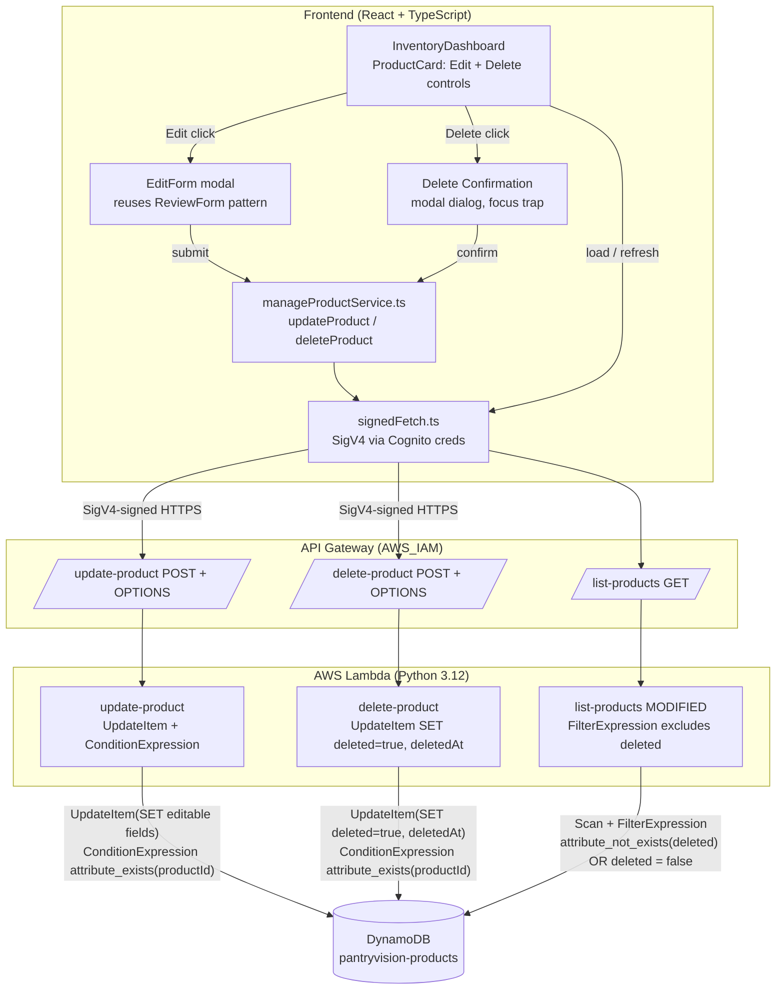

# Design Document

## Overview

This feature completes CRUD for PantryVision by adding **Update** and **soft
Delete** for products already saved in the inventory. Today the system supports
Create (`upload-product-photo` → `extract-product-data` → `save-product`) and
Read (`list-products`). This design introduces:

- **Two new backend Lambdas** (Python 3.12, boto3), mirroring the existing
  handler conventions (module-level clients, `lambda_handler(event, context)`
  entry point, responsibility-split helpers, `CORS_HEADERS`, structured error
  responses with error codes):
  - `update-product` — validates an edit payload and updates the editable text
    and date fields of an existing `Product_Record` via DynamoDB `UpdateItem`,
    preserving identity (`productId`) and image (`imageKey`).
  - `delete-product` — **soft-deletes** a `Product_Record` via DynamoDB
    `UpdateItem` by setting `deleted = true` and `deletedAt = <UTC ISO8601>`. It
    does **not** call `DeleteItem` and does **not** touch S3, so the record and
    its image are preserved for a future restore feature.
- **A modification to the existing `list-products` Lambda** — exclude records
  whose `deleted` attribute is `true` from the returned inventory, while keeping
  backward compatibility for existing records that have no `deleted` attribute.
- **Frontend Edit and Delete controls** on each product card in the
  `InventoryDashboard`: an Edit modal form (reusing the `ReviewForm` field
  pattern) and an accessible Delete confirmation dialog, both calling the new
  endpoints through the existing `signedFetch` SigV4 wrapper.

**Explicitly out of scope** (tracked as Future Considerations in the
requirements): changing a product photo, a restore/trash view, scheduled hard
purge of soft-deleted records, and optimistic-concurrency version checks. The
design preserves `imageKey` on update and preserves the S3 image on delete so
these future features remain possible without a data migration.

### Design principles applied

- **Serverless, pay-per-use** — Lambda + DynamoDB on-demand + API Gateway, no
  new persistent infrastructure (aligns with the project tech and AWS rules).
- **Least privilege** — `update-product` gets only `dynamodb:UpdateItem` on the
  table; `delete-product` gets only `dynamodb:UpdateItem` (no `DeleteItem`, no
  `s3:DeleteObject`).
- **Backward compatible** — soft delete is an additive attribute; existing
  records need no migration.
- **Consistency** — new endpoints reuse the AWS_IAM authorization model and the
  SigV4-via-Cognito calling convention already used by every other endpoint.

## Architecture

### Component flow



Notes:

- **All** calls to `/update-product` and `/delete-product` are signed with
  SigV4 using temporary Cognito Identity Pool credentials via `signedFetch`,
  identical to the existing upload/save/list calls.
- The `list-products` change is a pure server-side filter; the frontend contract
  (a JSON array of products) is unchanged.
- Neither new Lambda reads the item first (`GetItem` is intentionally avoided);
  the not-found case is detected by a conditional update, keeping IAM scoped to
  `UpdateItem` only.

### Existing-API integration decision (important)

The brief assumed the new resources attach to a single shared
`pantryvision-upload-api`. **Reading the current templates shows this is not the
case:** each endpoint today owns its own `AWS::ApiGateway::RestApi`
(`pantryvision-upload-api`, `pantryvision-save-api`, `pantryvision-list-api`,
`pantryvision-extract-api`), each with its own `AWS::ApiGateway::Deployment`,
and `cognito-identity-pool.yaml` scopes `execute-api:Invoke` per-API-ID
(`UploadApiId`, `ExtractApiId`, `SaveApiId`, `ListApiId`).

Given that established convention, two integration options exist:

- **Option A (recommended): the new template creates its own `RestApi`
  (`pantryvision-manage-api`) hosting both `/update-product` and
  `/delete-product`.** This matches every existing template exactly (one stack =
  one RestApi + Deployment), avoids the cross-stack "attach resources to an
  existing RestApi" problem entirely, and keeps each stack independently
  deployable. Cost is identical (API Gateway is per-request). The frontend gets
  the new base URL from a new Vite env var, exactly like the existing
  `VITE_SAVE_API_ENDPOINT` / `VITE_LIST_API_ENDPOINT`.
- **Option B: attach the two new resources to the pre-existing
  `pantryvision-upload-api`.** CloudFormation cannot define
  `AWS::ApiGateway::Resource`/`Method` against a RestApi it did not create
  unless it is given that RestApi's ID and root resource ID as template
  Parameters (`--parameter-overrides RestApiId=... RootResourceId=...`), and a
  **new `AWS::ApiGateway::Deployment` in this stack would redeploy that shared
  API**, which can race with the owning stack. This is the trickiest infra path
  and diverges from the current one-API-per-endpoint pattern.

**This design chooses Option A** because it is the least surprising given the
existing repo layout, is fully self-contained, and removes the cross-stack RestApi
coupling. (If the team later consolidates all endpoints under one API, that is a
separate refactor of every template, not part of this feature.)

Consequence for **Cognito**: regardless of option, `cognito-identity-pool.yaml`
must be extended so the unauthenticated role may invoke the two new methods, or
the SigV4-signed calls return **403**. With Option A this means adding a new
`ManageApiId` parameter and two new `execute-api:Invoke` resource ARNs
(`.../POST/update-product`, `.../POST/delete-product`). This is a required infra
change and is called out again in the Infrastructure section.

## Components and Interfaces

### API contracts

Both endpoints use `AWS_PROXY` integration and `AWS_IAM` authorization. Every
response (success and error) includes `CORS_HEADERS`
(`Access-Control-Allow-Origin: *`, `Content-Type: application/json`,
`Access-Control-Allow-Headers: Content-Type,Authorization`), consistent with the
existing Lambdas.

#### POST /update-product

Request body (JSON):

```json
{
  "productId": "b1e...uuid",
  "productName": "Whole Milk",
  "brand": "Acme",
  "presentation": "1 L carton",
  "expirationDate": "2026-01-15"
}
```

- `productId`: required, non-empty string.
- `productName`: required, 1–200 chars after trimming.
- `brand`: optional, 0–100 chars.
- `presentation`: optional, 0–100 chars.
- `expirationDate`: optional, empty string or `YYYY-MM-DD`.

Success `200`: the **complete** updated `Product_Record` (all attributes,
including the preserved `imageKey`, `createdAt`, `quantity`, `unit`).

Errors: `400 MISSING_PARAMS` (missing/empty `productId` or `productName`),
`400 INVALID_PARAMS` (a length limit exceeded), `400 INVALID_DATE` (bad date
format), `400 INVALID_JSON`, `404 NOT_FOUND`, `500 INTERNAL_ERROR`.

#### POST /delete-product

Request body (JSON):

```json
{ "productId": "b1e...uuid" }
```

- `productId`: required, string, length 1–256.

Success `200`: `{ "productId": "b1e...uuid" }` (returned within 5 seconds).

Errors: `400 MISSING_PARAMS` (missing / non-string / length 0 or > 256),
`400 INVALID_JSON`, `404 NOT_FOUND`, `500 INTERNAL_ERROR` (after retries
exhausted).

### Backend: `update-product` Lambda

File: `backend/update-product/handler.py`. Env var: `TABLE_NAME`. Module-level
`dynamodb = boto3.resource("dynamodb")`, `table = dynamodb.Table(TABLE_NAME)`.

Functions (snake_case, single responsibility, type hints):

- `lambda_handler(event, context) -> dict` — parse JSON body (→ `INVALID_JSON`
  on failure), call `parse_and_validate_payload`, call `update_product`, build
  responses; catches `ClientError`/`Exception` → `INTERNAL_ERROR`.
- `parse_and_validate_payload(body: dict) -> tuple[dict | None, dict | None]` —
  returns `(clean_fields, None)` on success or `(None, error_response)` on
  failure. Validation rules:
  - `productId`: must be a non-empty string → else `MISSING_PARAMS`.
  - `productName`: must be present and non-empty after `.strip()` →
    else `MISSING_PARAMS`; then length > 200 after trim → `INVALID_PARAMS`.
  - `brand`: coerced to trimmed string, length > 100 → `INVALID_PARAMS`.
  - `presentation`: coerced to trimmed string, length > 100 → `INVALID_PARAMS`.
  - `expirationDate`: empty allowed; if non-empty must match
    `^\d{4}-\d{2}-\d{2}$` **and** be a real calendar date
    (`datetime.strptime(value, "%Y-%m-%d")`) → else `INVALID_DATE`.
  - Returns the cleaned editable fields: `productName`, `brand`,
    `presentation`, `expirationDate` (all trimmed).
- `update_product(product_id: str, fields: dict) -> dict` — DynamoDB
  `table.update_item(...)` that **only SETs the four editable fields**
  (`productName`, `brand`, `presentation`, `expirationDate`) using
  `UpdateExpression` + `ExpressionAttributeNames`/`Values`, with
  `ConditionExpression="attribute_exists(productId)"` and
  `ReturnValues="ALL_NEW"`. Because only those fields are in the SET clause,
  `imageKey`, `createdAt`, `quantity`, `unit` (and any `deleted`/`deletedAt`) are
  untouched. A `ConditionalCheckFailedException` is caught and mapped to
  `404 NOT_FOUND`; other `ClientError`s propagate to `INTERNAL_ERROR`. Returns
  the `Attributes` (full updated record) from the response.
- `build_success_response(record: dict) -> dict`, and a shared
  `build_error_response(status_code, error_code, message) -> dict` identical in
  shape to the existing handlers.

`update-product` never sets or clears `deleted`/`deletedAt`, so editing a
soft-deleted record does not resurrect it (out of scope; restore is a future
feature).

### Backend: `delete-product` Lambda (soft delete)

File: `backend/delete-product/handler.py`. Env var: `TABLE_NAME`. Same
module-level client setup.

Functions:

- `lambda_handler(event, context) -> dict` — parse JSON (→ `INVALID_JSON`),
  `parse_and_validate_payload`, `soft_delete_product`, build responses.
- `parse_and_validate_payload(body: dict) -> tuple[str | None, dict | None]` —
  `productId` must be a `str` with `1 <= len <= 256` → else
  `400 MISSING_PARAMS` ("a valid productId is required"). Returns
  `(product_id, None)` or `(None, error_response)`.
- `soft_delete_product(product_id: str) -> None` — DynamoDB `update_item` with
  `UpdateExpression="SET #d = :true, #da = :now"`,
  `ExpressionAttributeNames={"#d": "deleted", "#da": "deletedAt"}`,
  `ExpressionAttributeValues={":true": True, ":now": <UTC ISO8601>}`,
  `ConditionExpression="attribute_exists(productId)"`. All other attributes are
  left untouched. `deletedAt` is produced with
  `datetime.now(timezone.utc).strftime("%Y-%m-%dT%H:%M:%SZ")` (same format
  `save-product` uses for `createdAt`). A `ConditionalCheckFailedException` →
  `404 NOT_FOUND`. **Transient** errors are retried up to **3 total attempts**
  (see Error Handling); `ConditionalCheckFailedException` and validation errors
  are **not** retried.
- `build_success_response(product_id: str) -> dict` → `200` with
  `{"productId": product_id}`; shared `build_error_response`.

`delete-product` imports no S3 client and has no S3 permission — the image is
provably untouched.

### Backend: `list-products` modification

Add a **DynamoDB `FilterExpression`** to the existing `scan_all_products()`
scan(s) so soft-deleted items are excluded:

```python
from boto3.dynamodb.conditions import Attr

filter_expr = Attr("deleted").not_exists() | Attr("deleted").eq(False)
response = table.scan(FilterExpression=filter_expr)
# ...and pass the same FilterExpression on paginated follow-up scans.
```

This keeps records that have **no** `deleted` attribute (all existing records)
and records with `deleted == false`, and drops records with `deleted == true`.
Nothing else in `list-products` changes (enrichment, sort, response shape are
untouched).

**FilterExpression vs. post-scan Python filter — decision:** DynamoDB applies a
`FilterExpression` **after** items are read, so it still scans and consumes read
capacity for the filtered-out items; it does not reduce cost versus filtering in
Python, it only reduces payload/marshalling. For the MVP's small single-user
inventory the two approaches are equivalent in practice. We choose the
`FilterExpression` because it keeps the exclusion rule declared at the data-access
boundary (a single source of truth close to the scan) and reduces items
transferred back to the Lambda. The tradeoff (no RCU savings) is acceptable at
MVP scale and is documented here so it is a conscious choice.

### Frontend: services

New file `frontend/src/services/manageProductService.ts`, using `signedFetch`
and the same error-class pattern as `productService.ts`.

```ts
export interface UpdateProductFields {
  productName: string;
  brand: string;
  presentation: string;
  expirationDate: string;
}
export type ManageProductErrorCode =
  | 'MISSING_PARAMS' | 'INVALID_PARAMS' | 'INVALID_DATE'
  | 'INVALID_JSON' | 'NOT_FOUND' | 'INTERNAL_ERROR' | 'UNKNOWN';

export class ManageProductError extends Error {
  code: ManageProductErrorCode;
  constructor(code: ManageProductErrorCode, message: string) { /* ... */ }
}

export async function updateProduct(
  productId: string,
  fields: UpdateProductFields,
): Promise<InventoryProduct> { /* signedFetch POST /update-product, 30s timeout */ }

export async function deleteProduct(productId: string): Promise<{ productId: string }>
{ /* signedFetch POST /delete-product, 10s timeout */ }
```

**Endpoint configuration decision:** the existing services each read their own
Vite env var (`VITE_SAVE_API_ENDPOINT`, `VITE_LIST_API_ENDPOINT`) because each
endpoint lives on a **different** RestApi. Since Option A gives the new endpoints
their **own** RestApi (`pantryvision-manage-api`), the frontend follows the same
established pattern and reads **one new base env var**,
`VITE_MANAGE_API_ENDPOINT`, deriving both URLs as
`${VITE_MANAGE_API_ENDPOINT}/update-product` and
`${VITE_MANAGE_API_ENDPOINT}/delete-product`. (Deriving the URL from the upload
base is only valid if the resources share the upload API, which Option A
deliberately avoids; a single new env var keeps consistency with the current
per-API convention.)

Request timeouts are enforced client-side with `AbortController`: 30s for update
(Req 4.4), 10s for delete (Req 5.6); a timeout is surfaced as a
`ManageProductError` so the UI treats it identically to a failure response.

### Frontend: `InventoryDashboard` / `ProductCard`

- `ProductCard` gains an **Edit** button and a **Delete** button. Both are real
  `<button type="button">` elements (keyboard-focusable by default). The Delete
  button has an accessible name identifying the product, e.g.
  `aria-label={t('inventoryDashboard.deleteProductLabel', { name: product.productName })}`
  (Req 5.1); the Edit button similarly (Req 4.1).
- `InventoryDashboard` holds the state driving the two overlays:
  `editingProduct: InventoryProduct | null` and
  `deletingProduct: InventoryProduct | null`, plus helpers to update one card in
  place (on edit success) or remove one card (on delete success) without a full
  reload.
- On edit success, the returned updated record replaces the matching item in
  `products` state (updates name/brand/presentation/expirationDate on the card,
  Req 4.5). On delete success, the item is removed from `products` state
  (Req 5.7).

### Frontend: `EditForm` (edit modal)

- Reuses the `ReviewForm` field layout/validation pattern (controlled inputs for
  productName/brand/presentation/expirationDate) inside a modal, pre-filled from
  the selected product's current values (Req 4.2).
- Client-side validation before submit: `productName` required after trim
  (Req 4.7) and ≤ 200 chars after trim (Req 4.8); on failure, block submit,
  retain entered values, show a validation message.
- On submit: disable the submit control and show a loading indicator; call
  `updateProduct(productId, fields)` (Req 4.3, 4.4). On success: close and update
  the card (Req 4.5). On error or 30s timeout: keep the form open with entered
  values, re-enable submit, show an error message (Req 4.6).

### Frontend: `DeleteConfirmation` (modal dialog)

- Accessible modal dialog (`role="dialog"` + `aria-modal="true"` +
  `aria-labelledby`) showing the product name (Req 5.2, 5.3).
- Focus management: on open, move focus into the dialog; **trap** focus within
  the dialog controls while open; on close/cancel, return focus to the Delete
  control that opened it (Req 5.2, 5.3, 5.5).
- Confirm → `deleteProduct(productId)` (Req 5.4). While in progress: show a
  loading indicator and disable both confirm and dismiss (Req 5.6). On success
  within 10s: remove the card and close (Req 5.7). On error or 10s timeout: keep
  the card, re-enable both controls, show an error message (Req 5.8). Cancel:
  close, no change, restore focus (Req 5.5).

## Data Models

### Product_Record (DynamoDB item, table `pantryvision-products`, key `productId`)

| Attribute        | Type    | Origin / Notes                                                        |
|------------------|---------|-----------------------------------------------------------------------|
| `productId`      | String  | Partition key. **Immutable** (never changed by update or delete).     |
| `productName`    | String  | Editable. 1–200 chars (trimmed).                                      |
| `brand`          | String  | Editable. 0–100 chars.                                                |
| `presentation`   | String  | Editable. 0–100 chars.                                                |
| `expirationDate` | String  | Editable. `""` or `YYYY-MM-DD`.                                       |
| `imageKey`       | String  | **Immutable** in this feature (photo change is out of scope).         |
| `createdAt`      | String  | ISO8601. Preserved by update and delete.                              |
| `quantity`       | Number  | Preserved by update and delete (not in the edit payload).             |
| `unit`           | String  | Preserved by update and delete.                                       |
| `deleted`        | Bool    | **New, optional.** Set to `true` by soft delete. Absent = not deleted.|
| `deletedAt`      | String  | **New, optional.** UTC ISO8601 set when soft-deleted. Absent otherwise.|

**Backward compatibility (no migration):** existing records were written by
`save-product` without `deleted`/`deletedAt`. The system treats a **missing**
`deleted` attribute as "not deleted" everywhere:

- `list-products` includes items where `deleted` is absent or `false`.
- `update-product` only SETs editable fields, so it never introduces
  `deleted`/`deletedAt`.
- `delete-product` adds these attributes on demand.

No backfill or table change is required; the DynamoDB table template stays as-is.

## Correctness Properties

*A property is a characteristic or behavior that should hold true across all
valid executions of a system — essentially, a formal statement about what the
system should do. Properties serve as the bridge between human-readable
specifications and machine-verifiable correctness guarantees.*

The properties below target the **pure validation and record-transformation
logic** of the two new Lambdas and the `list-products` filter. DynamoDB is mocked
(moto / stubbed `Table`) so 100+ iterations are cheap and test *our* logic, not
AWS behavior. Infrastructure wiring, CORS, and IAM authorization are verified by
example/integration tests instead (see Testing Strategy).

### Property 1: Update preserves immutable and untouched fields

*For any* existing `Product_Record` and *any* valid edit payload, applying
`update-product` yields a record whose `productId`, `imageKey`, `createdAt`,
`quantity`, and `unit` are byte-for-byte unchanged, and whose `productName`,
`brand`, `presentation`, `expirationDate` equal the trimmed submitted values.

**Validates: Requirements 1.1, 1.3, 1.4**

### Property 2: Invalid update payloads are rejected with the correct code and never mutate the record

*For any* payload that violates a field constraint (missing/empty `productId` →
`MISSING_PARAMS`; missing/empty `productName` → `MISSING_PARAMS`; `productName`
> 200, `brand` > 100, or `presentation` > 100 after trim → `INVALID_PARAMS`;
non-empty `expirationDate` not matching a real `YYYY-MM-DD` → `INVALID_DATE`),
`update-product` returns HTTP 400 with that exact error code and performs no
DynamoDB write (the stored record is unchanged).

**Validates: Requirements 1.5, 1.6, 1.7, 1.11**

### Property 3: Soft delete sets the deletion attributes and preserves everything else

*For any* existing `Product_Record`, applying `delete-product` results in a
record with `deleted == true` and a `deletedAt` that parses as a valid UTC
ISO8601 timestamp, while every other attribute (`productId`, `imageKey`,
`productName`, `brand`, `presentation`, `expirationDate`, `createdAt`,
`quantity`, `unit`) is unchanged.

**Validates: Requirements 2.1, 2.2**

### Property 4: Soft delete is idempotent-safe

*For any* existing `Product_Record`, applying `delete-product` twice in
succession leaves the record with `deleted == true` (a second delete of an
already-deleted-but-present record still succeeds with HTTP 200 and a valid
`deletedAt`, because `attribute_exists(productId)` still holds). Re-deleting a
present record never returns 404.

**Validates: Requirements 2.1, 2.6**

> Design decision: re-deleting an already-soft-deleted (but still present) record
> returns **200**, not 404, because 404 is defined by the requirements as "no
> record with that productId exists". A soft-deleted record still exists, so the
> conditional update succeeds and simply refreshes `deletedAt`.

### Property 5: list-products excludes deleted and includes legacy/undeleted records

*For any* set of `Product_Record`s, `list-products` returns exactly those records
whose `deleted` attribute is absent or `false`, and returns none whose `deleted`
is `true`. In particular, records lacking the `deleted` attribute (legacy
records) always appear.

**Validates: Requirements 3.1, 3.2, 3.3**

### Property 6: Logs never contain PII or credentials

*For any* request (valid or invalid) to `update-product` or `delete-product`, the
strings written to CloudWatch Logs contain no credentials/secrets and no
personally identifiable product content beyond non-identifying diagnostics
(e.g., `productId` and error codes), and never full request bodies with
user-entered field values.

**Validates: Requirements 1.10, 2.9, 8.5**

## Error Handling

All errors return the shared response shape
`{"error": <CODE>, "message": <safe message>}` with `CORS_HEADERS`, matching the
existing handlers. Client-facing messages never expose internal DynamoDB details;
internals are logged via `logger.error` / `logger.exception` (status ≥ 500) or
`logger.warning` (status < 500), consistent with the existing
`build_error_response`.

### update-product

| Condition                                                       | HTTP | Error code       | Req      |
|-----------------------------------------------------------------|------|------------------|----------|
| Body not valid JSON                                             | 400  | `INVALID_JSON`   | 1.9      |
| Missing/empty `productId`                                       | 400  | `MISSING_PARAMS` | 1.5      |
| Missing/empty `productName` (after trim)                        | 400  | `MISSING_PARAMS` | 1.6      |
| `productName` > 200 / `brand` > 100 / `presentation` > 100      | 400  | `INVALID_PARAMS` | 1.11     |
| `expirationDate` non-empty and not a real `YYYY-MM-DD`          | 400  | `INVALID_DATE`   | 1.7      |
| No record with `productId` (`ConditionalCheckFailedException`)  | 404  | `NOT_FOUND`      | 1.8      |
| DynamoDB / unexpected failure                                   | 500  | `INTERNAL_ERROR` | 1.10     |

### delete-product

| Condition                                                       | HTTP | Error code       | Req      |
|-----------------------------------------------------------------|------|------------------|----------|
| Body not valid JSON                                             | 400  | `INVALID_JSON`   | 2.7      |
| Missing / non-string / length 0 or > 256 `productId`            | 400  | `MISSING_PARAMS` | 2.5      |
| No record with `productId` (`ConditionalCheckFailedException`)  | 404  | `NOT_FOUND`      | 2.6      |
| Transient DynamoDB error                                        | —    | retried (≤ 3 total attempts) | 2.8 |
| Failure after retries exhausted                                 | 500  | `INTERNAL_ERROR` | 2.9      |

**Retry policy (delete):** wrap the `update_item` call in a loop of up to 3 total
attempts. Retry only on *transient* `ClientError`s (e.g.
`ProvisionedThroughputExceededException`, `ThrottlingException`,
`InternalServerError`, `RequestLimitExceeded`) with a short backoff.
`ConditionalCheckFailedException` (→ 404) and validation errors are **never**
retried. If all attempts fail transiently → `500 INTERNAL_ERROR`.

**Frontend error handling:** service-layer timeouts (30s update / 10s delete) and
non-2xx responses both raise `ManageProductError`; the Edit form keeps its values
and re-enables submit (Req 4.6), and the Delete dialog keeps the card and
re-enables its controls (Req 5.8).

## Testing Strategy

Property-based testing **is applicable** here because the validation and
record-transformation logic of the two Lambdas and the list filter are pure,
input-driven functions with universal invariants (preservation, rejection,
idempotence). Infrastructure and UI concerns use example/integration/snapshot
tests instead.

### Backend unit + property tests (pytest + Hypothesis, moto for DynamoDB)

- **Library:** use **Hypothesis** for property tests (do not hand-roll
  generators/shrinking) and **moto** (or a stubbed `Table`) to mock DynamoDB.
- **Configuration:** each property test runs a **minimum of 100 iterations**
  (`@settings(max_examples=100)`).
- **Tagging:** each property test is annotated with a comment referencing its
  design property, format:
  `# Feature: manage-products, Property {number}: {property_text}`.
- **Coverage mapping:**
  - Property 1 → one Hypothesis test generating a random valid record + valid
    edit payload; assert immutable/untouched fields unchanged and editable fields
    equal trimmed inputs.
  - Property 2 → one Hypothesis test generating constraint-violating payloads;
    assert 400 + exact error code and that the mocked table item is unchanged.
  - Property 3 → one Hypothesis test over random records; assert `deleted == true`,
    `deletedAt` parses as UTC ISO8601, all other attributes preserved.
  - Property 4 → one Hypothesis test applying delete twice; assert final state
    `deleted == true` and second call returns 200 (not 404).
  - Property 5 → one Hypothesis test generating a random mix of deleted /
    undeleted / legacy (no `deleted` attr) records; assert the returned set is
    exactly the non-deleted ones.
  - Property 6 → capture logs (caplog) across generated valid/invalid requests;
    assert no full request body / field values / credentials are logged.
- **Example / edge-case unit tests** (concrete, not property):
  - `INVALID_JSON` for a malformed body on both Lambdas (Req 1.9, 2.7).
  - `404 NOT_FOUND` when the conditional update raises
    `ConditionalCheckFailedException` (Req 1.8, 2.6).
  - Delete retry: transient error twice then success (Req 2.8); transient error
    on all 3 attempts → `500` (Req 2.9).
  - `list-products` still returns legacy records that lack `deleted` (Req 3.2).
  - Boundary values: `productName` length 200 (ok) vs 201 (`INVALID_PARAMS`);
    `productId` length 256 (ok) vs 257 (`MISSING_PARAMS`); empty
    `expirationDate` accepted.

### Frontend tests (Vitest, consistent with project conventions)

- **Service tests** (`manageProductService.ts`): mock `signedFetch`; assert
  correct URL/method/body, 2xx returns parsed record, non-2xx raises
  `ManageProductError` with the mapped code, and that a simulated timeout
  (AbortController) raises the error (Req 4.4, 4.6, 5.6, 5.8).
- **EditForm interaction tests:** empty/whitespace `productName` blocks submit and
  shows a validation message with values retained (Req 4.7); > 200 chars blocks
  submit with a length message (Req 4.8); success closes and updates the card
  (Req 4.5); error keeps form open, values retained, submit re-enabled (Req 4.6).
- **DeleteConfirmation tests:** opening moves focus into the dialog and it is
  exposed as a modal (`role="dialog"`, `aria-modal="true"`) showing the product
  name (Req 5.2, 5.3); focus is trapped while open; cancel closes with no change
  and returns focus to the Delete control (Req 5.5); confirm shows loading and
  disables controls (Req 5.6), success removes the card (Req 5.7), error keeps the
  card and re-enables controls (Req 5.8).
- **ProductCard accessibility tests:** Edit and Delete controls are focusable
  buttons with accessible names (Req 4.1, 5.1).

### Infrastructure / integration tests (not PBT)

- **CloudFormation validation:** `aws cloudformation validate-template` on the new
  template; confirm IAM policies contain only `dynamodb:UpdateItem` on the table
  ARN and **no** `DeleteItem` / `s3:*` (Req 8.1–8.4).
- **Deployed smoke test (1–3 examples):** signed round-trip through API Gateway —
  update then list (edited product visible), delete then list (product absent) —
  verifying AWS_IAM + SigV4 + CORS wiring end to end (Req 6.2–6.4, 7.1, 7.2).
- **403 regression check:** confirm the extended Cognito policy actually permits
  invoking `/update-product` and `/delete-product` (guards the required Cognito
  change below).

## Infrastructure Design

New template **`infra/lambda-manage-products.yaml`** (one combined stack for
update + delete, since they are closely related and share conventions), mirroring
`lambda-save-product.yaml`. It defines:

1. **Two IAM execution roles** (least privilege, per Req 8):
   - `update-product-execution-role`: `AWSLambdaBasicExecutionRole` +
     inline `dynamodb:UpdateItem` on
     `arn:aws:dynamodb:${AWS::Region}:${AWS::AccountId}:table/${TableName}` only.
   - `delete-product-execution-role`: `AWSLambdaBasicExecutionRole` +
     inline `dynamodb:UpdateItem` on the same table ARN only.
     **No `dynamodb:DeleteItem`, no `s3:*`** — the not-found case is handled by a
     conditional `UpdateItem` (Req 8.3), so `GetItem`/`DeleteItem` are unnecessary.
2. **Two Lambda functions** `update-product` and `delete-product` (python3.12,
   `handler.lambda_handler`, 128 MB, 10 s timeout, `TABLE_NAME` env var, code from
   `pantryvision-deployment-${AWS::AccountId}` at
   `backend/update-product.zip` / `backend/delete-product.zip`).
3. **One RestApi** `pantryvision-manage-api` (REGIONAL) — **Option A** from the
   Architecture section — with resources `/update-product` and `/delete-product`,
   each having a `POST` method (`AuthorizationType: AWS_IAM`, `AWS_PROXY`
   integration to the respective Lambda) and an `OPTIONS` method
   (`AuthorizationType: NONE`, `MOCK` integration returning the same CORS
   preflight headers as the existing templates).
4. **Two `AWS::Lambda::Permission`** resources granting
   `apigateway.amazonaws.com` `lambda:InvokeFunction`, scoped to
   `.../POST/update-product` and `.../POST/delete-product`.
5. **One `AWS::ApiGateway::Deployment`** (`DependsOn` all four methods) to the
   `StageName` (default `prod`).
6. **Outputs:** `ManageApiEndpoint`
   (`https://${ManageApi}.execute-api.${AWS::Region}.amazonaws.com/${StageName}`),
   `ManageApiId` (`!Ref ManageApi`), and both function ARNs.

### Required change to `cognito-identity-pool.yaml` (flagged)

The unauthenticated role currently scopes `execute-api:Invoke` to exactly four
method ARNs. **Without adding the two new methods, SigV4-signed calls to the new
endpoints will return 403.** This template MUST be extended:

- Add a parameter `ManageApiId` (the `ManageApiId` output of the new stack).
- Add two resource ARNs to the `execute-api-invoke-policy`:
  - `arn:aws:execute-api:${AWS::Region}:${AWS::AccountId}:${ManageApiId}/*/POST/update-product`
  - `arn:aws:execute-api:${AWS::Region}:${AWS::AccountId}:${ManageApiId}/*/POST/delete-product`

This is a required, coupled infra change and must ship with this feature.

### Deploy-time notes

- If the team ever selects Option B (attaching to the existing
  `pantryvision-upload-api`) instead, the new template would take `RestApiId` and
  `RootResourceId` as Parameters supplied via
  `--parameter-overrides RestApiId=<id> RootResourceId=<root-id>`, and creating a
  Deployment here would redeploy that shared API — a coordination hazard with the
  upload stack. Option A avoids this and is the recommended path.
- A new Vite env var `VITE_MANAGE_API_ENDPOINT` (set to the `ManageApiEndpoint`
  output) is added to the frontend build configuration, consistent with the
  existing `VITE_SAVE_API_ENDPOINT` / `VITE_LIST_API_ENDPOINT`.
