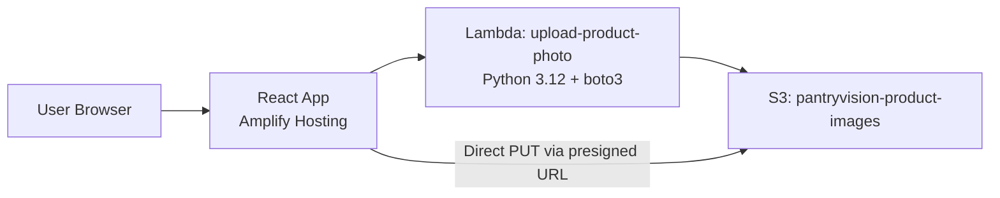
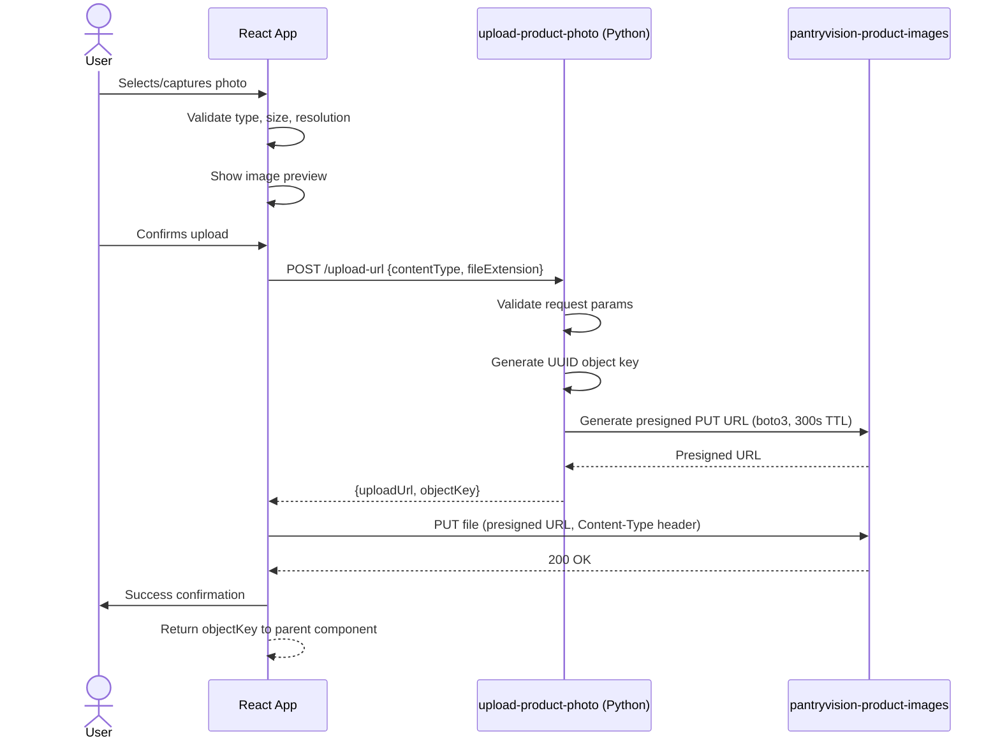
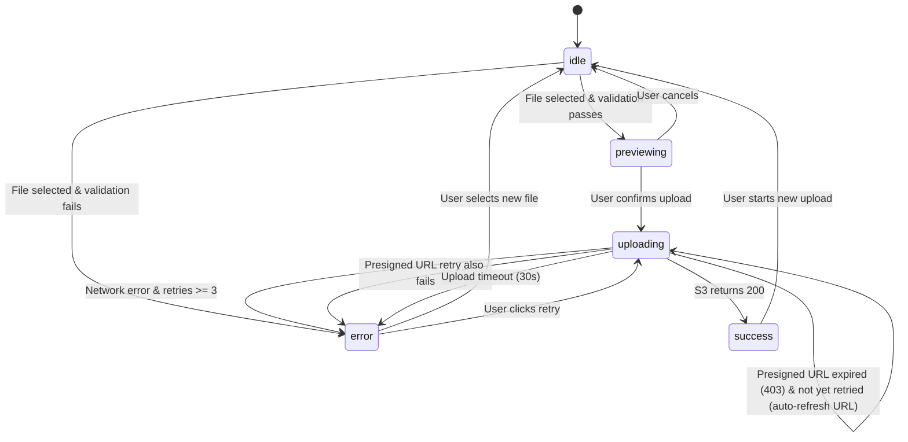
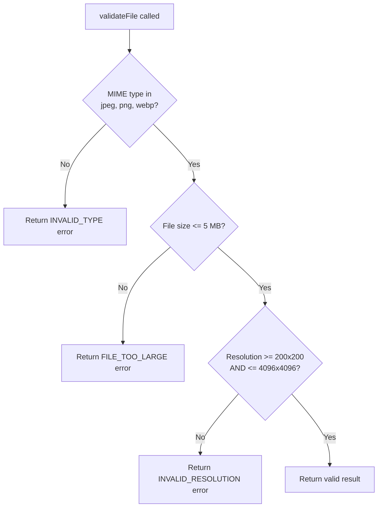

# Design Document: Upload Product Photo

## Overview

This design describes how PantryVision users upload product photos from the browser to a private S3 bucket. The system uses a serverless architecture where the React frontend requests a presigned PUT URL from an AWS Lambda function (Python 3.12 + boto3), then uploads the image directly to S3 without routing file data through the backend. This keeps costs low, scales automatically, and avoids exposing AWS credentials to the client.

Key design decisions:
- **Direct-to-S3 upload via presigned URL**: Avoids Lambda payload size limits (6 MB) and reduces backend costs since large file data never passes through Lambda.
- **Python 3.12 + boto3**: The Lambda function uses Python 3.12 runtime with boto3 for S3 presigned URL generation — lightweight, no external framework needed.
- **Single Lambda function**: One function handles presigned URL generation, keeping the architecture simple.
- **Client-side validation first**: The frontend validates file type, size, and resolution before making any API call, reducing unnecessary backend invocations.
- **UUID-based object keys**: Each upload gets a unique key (`{uuid}.{ext}`) preventing collisions and making keys non-guessable.

## Architecture

### High-Level Architecture



### Component Responsibilities

| Component | Responsibility |
|-----------|---------------|
| Photo_Uploader (React) | File selection/capture, validation, preview, presigned URL request, direct S3 upload, progress & error display |
| Upload_API (Lambda - Python) | Request validation, authentication check, presigned URL generation via boto3, error responses |
| Image_Store (S3) | Store image objects, enforce CORS, deny public access, enforce content-length limits via presigned conditions |

### Sequence Diagram



### Upload State Diagram



### File Validation Flowchart



## Components and Interfaces

### Frontend: Photo_Uploader Component

**Location**: `/frontend/src/components/PhotoUploader.tsx`

```typescript
// Component interface
interface PhotoUploaderProps {
  onUploadComplete: (objectKey: string) => void;
  onError?: (error: UploadError) => void;
}

interface UploadError {
  code: 'INVALID_TYPE' | 'FILE_TOO_LARGE' | 'INVALID_RESOLUTION' | 'NETWORK_ERROR' | 'TIMEOUT' | 'PRESIGN_FAILED' | 'PREVIEW_FAILED';
  message: string;
}

type UploadState = 'idle' | 'previewing' | 'uploading' | 'success' | 'error';
```

**Key functions**:

```typescript
// Validates the file before starting the upload flow
function validateFile(file: File): Promise<ValidationResult>

// Requests a presigned URL from the backend
function requestPresignedUrl(contentType: string, fileExtension: string): Promise<PresignedUrlResponse>

// Uploads the file directly to S3 using the presigned URL
function uploadToS3(file: File, presignedUrl: string): Promise<void>

// Retries the upload with a new presigned URL if the previous one expired
function retryWithNewPresignedUrl(file: File, contentType: string, fileExtension: string): Promise<void>
```

**Validation rules** (enforced client-side before API call):
- MIME type: `image/jpeg`, `image/png`, `image/webp`
- Max file size: 5 MB (5,242,880 bytes)
- Resolution: minimum 200×200 px, maximum 4096×4096 px
- Camera access: check `navigator.mediaDevices` availability

### Backend: Upload_API Lambda Function

**Location**: `/backend/upload-product-photo/handler.py`

**Runtime**: Python 3.12
**Handler**: `handler.lambda_handler`
**Memory**: 128 MB
**Timeout**: 10 seconds

**Dependencies**:
- `boto3` — AWS SDK for Python (included in Lambda runtime)
- `uuid` — UUID v4 generation (Python standard library)

```python
# Request body type
# {
#   "contentType": str,    # e.g., "image/jpeg"
#   "fileExtension": str   # e.g., "jpeg"
# }

# Success response type
# {
#   "uploadUrl": str,   # Presigned PUT URL
#   "objectKey": str    # e.g., "a1b2c3d4-e5f6-7890-abcd-ef1234567890.jpeg"
# }

# Error response type
# {
#   "error": str,
#   "message": str
# }
```

**Lambda handler implementation**:

```python
import json
import os
import uuid
import logging

import boto3
from botocore.exceptions import ClientError

logger = logging.getLogger()
logger.setLevel(logging.INFO)

s3_client = boto3.client("s3", region_name=os.environ.get("AWS_REGION"))
BUCKET_NAME = os.environ["BUCKET_NAME"]
MAX_CONTENT_LENGTH = 5 * 1024 * 1024  # 5 MB
ALLOWED_CONTENT_TYPES = {"image/jpeg", "image/png", "image/webp"}
URL_EXPIRATION_SECONDS = 300


def lambda_handler(event, context):
    """Generate a presigned PUT URL for uploading a product photo to S3."""
    try:
        body = json.loads(event.get("body", "{}"))
    except (json.JSONDecodeError, TypeError):
        body = {}

    content_type = body.get("contentType")
    file_extension = body.get("fileExtension")

    # Validate required parameters
    if not content_type or not file_extension:
        return _error_response(400, "MISSING_PARAMS", "contentType and fileExtension are required")

    # Validate content type
    if content_type not in ALLOWED_CONTENT_TYPES:
        return _error_response(400, "INVALID_CONTENT_TYPE", "Allowed types: image/jpeg, image/png, image/webp")

    # Generate unique object key
    object_key = f"{uuid.uuid4()}.{file_extension}"

    try:
        # Generate presigned URL with conditions
        upload_url = s3_client.generate_presigned_url(
            ClientMethod="put_object",
            Params={
                "Bucket": BUCKET_NAME,
                "Key": object_key,
                "ContentType": content_type,
            },
            ExpiresIn=URL_EXPIRATION_SECONDS,
        )
    except ClientError as e:
        logger.error("Failed to generate presigned URL: %s", str(e))
        return _error_response(500, "INTERNAL_ERROR", "Failed to generate upload URL")

    return {
        "statusCode": 200,
        "headers": {
            "Content-Type": "application/json",
            "Access-Control-Allow-Origin": "*",
        },
        "body": json.dumps({
            "uploadUrl": upload_url,
            "objectKey": object_key,
        }),
    }


def _error_response(status_code: int, error_code: str, message: str) -> dict:
    """Build a standardized error response."""
    log_level = logging.WARNING if status_code < 500 else logging.ERROR
    logger.log(log_level, "%s: %s", error_code, message)

    return {
        "statusCode": status_code,
        "headers": {
            "Content-Type": "application/json",
            "Access-Control-Allow-Origin": "*",
        },
        "body": json.dumps({
            "error": error_code,
            "message": message,
        }),
    }
```

### API Endpoint Definition

**Endpoint**: `POST /upload-url`
**Authentication**: IAM-based (AWS Signature V4 via Amplify Auth)

**Request**:
```json
{
  "contentType": "image/jpeg",
  "fileExtension": "jpeg"
}
```

**Success Response (200)**:
```json
{
  "uploadUrl": "https://pantryvision-product-images.s3.amazonaws.com/a1b2c3d4...?X-Amz-Algorithm=...",
  "objectKey": "a1b2c3d4-e5f6-7890-abcd-ef1234567890.jpeg"
}
```

**Error Responses**:

| Status | Condition | Response Body |
|--------|-----------|---------------|
| 400 | Missing contentType or fileExtension | `{"error": "MISSING_PARAMS", "message": "contentType and fileExtension are required"}` |
| 400 | Invalid content type | `{"error": "INVALID_CONTENT_TYPE", "message": "Allowed types: image/jpeg, image/png, image/webp"}` |
| 401 | Authentication failure | `{"error": "UNAUTHORIZED", "message": "Authentication required"}` |
| 500 | Internal error (boto3/S3 failure) | `{"error": "INTERNAL_ERROR", "message": "Failed to generate upload URL"}` |

### S3 Bucket Configuration

**Bucket name**: `pantryvision-product-images`

**Access Control**:
- Block all public access (BlockPublicAcls, BlockPublicPolicy, IgnorePublicAcls, RestrictPublicBuckets = true)
- No bucket policy granting public access
- Access only via IAM roles and presigned URLs

**CORS Configuration**:
```json
[
  {
    "AllowedHeaders": ["Content-Type"],
    "AllowedMethods": ["PUT"],
    "AllowedOrigins": ["https://<amplify-app-domain>"],
    "ExposeHeaders": ["ETag"],
    "MaxAgeSeconds": 3600
  }
]
```

**IAM Policy for Lambda execution role** (minimum required permissions):
```json
{
  "Version": "2012-10-17",
  "Statement": [
    {
      "Effect": "Allow",
      "Action": ["s3:PutObject"],
      "Resource": "arn:aws:s3:::pantryvision-product-images/*"
    }
  ]
}
```

## Data Models

### Upload Request Flow Data

```typescript
// Internal state of the PhotoUploader component
interface PhotoUploaderState {
  state: UploadState;
  selectedFile: File | null;
  previewUrl: string | null;       // Object URL for local preview
  uploadProgress: number;          // 0-100
  retryCount: number;              // Max 3 retries for network errors
  presignRetried: boolean;         // Whether presigned URL was refreshed
  errorInfo: UploadError | null;
}

// Backend response when requesting presigned URL
interface PresignedUrlResponse {
  uploadUrl: string;
  objectKey: string;
}

// Final result delivered to the parent component
interface UploadResult {
  objectKey: string;               // S3 key for the uploaded image
  contentType: string;             // MIME type of the uploaded file
}
```

### S3 Object Structure

Objects are stored flat in the bucket root with UUID-based keys:

```
pantryvision-product-images/
├── a1b2c3d4-e5f6-7890-abcd-ef1234567890.jpeg
├── b2c3d4e5-f6a7-8901-bcde-f23456789012.png
└── c3d4e5f6-a7b8-9012-cdef-345678901234.webp
```

No folder structure is needed at this stage. The object key is stored in DynamoDB (by the downstream product registration feature) to associate images with products.

## Correctness Properties

*A property is a characteristic or behavior that should hold true across all valid executions of a system — essentially, a formal statement about what the system should do. Properties serve as the bridge between human-readable specifications and machine-verifiable correctness guarantees.*

### Property 1: File type validation rejects invalid MIME types

*For any* file whose MIME type is not in the set {`image/jpeg`, `image/png`, `image/webp`}, the `validateFile()` function SHALL return a rejection result and the upload flow SHALL NOT be initiated.

**Validates: Requirements 1.3, 1.4**

### Property 2: File size validation rejects oversized files

*For any* file larger than 5,242,880 bytes (5 MB), regardless of its MIME type being valid, the `validateFile()` function SHALL return a rejection result indicating the maximum file size constraint.

**Validates: Requirements 1.5**

### Property 3: Resolution validation rejects out-of-bounds images

*For any* image with dimensions where width < 200 OR height < 200 OR width > 4096 OR height > 4096 pixels, the `validateFile()` function SHALL return a rejection result indicating the resolution constraint.

**Validates: Requirements 1.8**

### Property 4: Presigned URL generation produces unique object keys

*For any* sequence of N presigned URL generation requests (even with identical contentType and fileExtension parameters), all N generated object keys SHALL be distinct from one another.

**Validates: Requirements 2.2, 4.7**

### Property 5: Presigned URL scoped to requested content type

*For any* valid presigned URL request with a given contentType, the generated `put_object` Params SHALL include that exact contentType as the `ContentType` parameter, ensuring the presigned URL only permits upload of that specific type.

**Validates: Requirements 2.4**

### Property 6: Backend rejects invalid content types

*For any* contentType string not in the set {`image/jpeg`, `image/png`, `image/webp`}, the `lambda_handler` SHALL return an HTTP 400 response with error code `INVALID_CONTENT_TYPE` without invoking the S3 presigned URL generation.

**Validates: Requirements 4.4, 4.5**

### Property 7: Backend rejects requests with missing parameters

*For any* request body that is missing the `contentType` field, the `fileExtension` field, or both, the `lambda_handler` SHALL return an HTTP 400 response with error code `MISSING_PARAMS`.

**Validates: Requirements 2.8**

### Property 8: Successful upload propagates correct object key

*For any* valid image file where the upload completes successfully (S3 returns 200), the Photo_Uploader SHALL invoke `onUploadComplete` with the exact same `objectKey` value received from the presigned URL response.

**Validates: Requirements 3.3**

### Property 9: Network error retry bounded to 3 attempts

*For any* upload that encounters consecutive network failures, the Photo_Uploader SHALL allow retry attempts up to and including a maximum of 3 retries, and SHALL display a final error state after the third failure.

**Validates: Requirements 3.4**

### Property 10: Cancel from preview resets to initial state

*For any* state where a preview is being displayed, activating the cancel action SHALL return the component to the idle state with no selected file, no preview URL, and zero upload progress.

**Validates: Requirements 5.2**

## Error Handling

### Frontend Error Handling Strategy

| Error Scenario | Detection | User Action | System Behavior |
|----------------|-----------|-------------|-----------------|
| Invalid file type | Client-side MIME check | Show error, allow new selection | Block upload flow |
| File too large | Client-side size check | Show error with 5 MB limit | Block upload flow |
| Invalid resolution | Client-side Image() load | Show error, allow new selection | Block upload flow |
| Camera unavailable | `navigator.mediaDevices` check | Hide camera option | Graceful degradation |
| Presigned URL request fails | HTTP status !== 200 | Show error, allow retry | Log error details |
| Network error during upload | `fetch` catch / XMLHttpRequest error | Show error, allow retry (max 3) | Increment retry counter |
| Presigned URL expired | S3 returns 403 | Transparent to user (auto-retry) | Request new URL, retry once |
| Upload timeout (30s) | AbortController timeout | Show timeout error, allow retry | Abort request, reset state |
| Preview render failure | Image `onerror` event | Show error, allow new selection | Reset to idle state |

### Backend Error Handling Strategy (Python)

| Error Scenario | HTTP Status | Error Code | Log Level |
|----------------|-------------|------------|-----------|
| Missing request body params | 400 | MISSING_PARAMS | WARNING |
| Invalid content type | 400 | INVALID_CONTENT_TYPE | WARNING |
| Authentication failure | 401 | UNAUTHORIZED | WARNING |
| boto3 ClientError | 500 | INTERNAL_ERROR | ERROR |
| Unexpected exception | 500 | INTERNAL_ERROR | ERROR |

**Backend error handling pattern**:

```python
try:
    # Business logic
    upload_url = s3_client.generate_presigned_url(...)
except ClientError as e:
    logger.error("S3 presigned URL generation failed: %s", str(e))
    return _error_response(500, "INTERNAL_ERROR", "Failed to generate upload URL")
except Exception as e:
    logger.error("Unexpected error: %s", str(e))
    return _error_response(500, "INTERNAL_ERROR", "Failed to generate upload URL")
```

### Retry Logic (Frontend)

```
Upload attempt
├── Success → Done
├── Network error → Retry (up to 3 times, exponential backoff: 1s, 2s, 4s)
├── 403 (expired URL) → Request new presigned URL → Retry once
│   ├── Success → Done
│   └── Failure → Show final error
└── Timeout (30s) → Abort → Show timeout error, allow manual retry
```

### Error Message Guidelines

- All user-facing error messages should be clear and actionable
- Technical details (status codes, S3 errors) should be logged to the console but not shown to the user
- Messages should indicate what went wrong and what the user can do next

## Testing Strategy

### Unit Tests

Unit tests cover isolated component and function behavior with specific examples:

**Frontend (React Testing Library + Vitest)**:
- `validateFile()` accepts a valid JPEG file of 2 MB at 800×600
- `validateFile()` rejects a PDF file (specific invalid type)
- Component renders idle state on initial mount
- Component renders preview state after file selection
- Component shows progress bar during upload
- Cancel button from preview state returns to idle
- Camera option hidden when `navigator.mediaDevices` unavailable
- Expired presigned URL triggers automatic refresh and retry
- Timeout at 30 seconds aborts request and shows error
- No AWS credential patterns appear in any component state or response

**Backend (pytest + moto for S3 mocking)**:
- `lambda_handler` returns 200 with valid uploadUrl and objectKey for image/jpeg
- `lambda_handler` returns 500 when boto3 raises ClientError
- `lambda_handler` returns 401 when auth context missing
- Generated objectKey matches pattern `{uuid-v4}.{extension}`
- Presigned URL expiration set to 300 seconds
- ContentType param matches requested content type

### Property-Based Tests

Property-based testing is split across backend and frontend:

- **Backend**: `pytest` + `hypothesis` (Python)
- **Frontend**: `vitest` + `fast-check` (TypeScript)

Each property test runs a minimum of 100 iterations with randomly generated inputs.

**Backend property tests (pytest + hypothesis)**:

- **Feature: upload-product-photo, Property 4: Presigned URL generation produces unique object keys**
  Generate N valid requests with identical params → collect all object keys → assert all are distinct

- **Feature: upload-product-photo, Property 5: Presigned URL scoped to requested content type**
  Generate random contentType from allowed set → assert put_object Params include that exact ContentType

- **Feature: upload-product-photo, Property 6: Backend rejects invalid content types**
  Generate random strings not in {image/jpeg, image/png, image/webp} → assert handler returns 400 with INVALID_CONTENT_TYPE

- **Feature: upload-product-photo, Property 7: Backend rejects requests with missing parameters**
  Generate request objects with randomly omitted contentType/fileExtension fields → assert 400 with MISSING_PARAMS

**Frontend property tests (vitest + fast-check)**:

- **Feature: upload-product-photo, Property 1: File type validation rejects invalid MIME types**
  Generate random strings not in {image/jpeg, image/png, image/webp} → assert `validateFile()` returns rejection

- **Feature: upload-product-photo, Property 2: File size validation rejects oversized files**
  Generate random integers > 5,242,880 → assert `validateFile()` returns size rejection

- **Feature: upload-product-photo, Property 3: Resolution validation rejects out-of-bounds images**
  Generate random (width, height) pairs outside [200, 4096] range → assert rejection

- **Feature: upload-product-photo, Property 8: Successful upload propagates correct object key**
  Generate random valid files with mocked successful upload → assert onUploadComplete receives exact objectKey from presigned response

- **Feature: upload-product-photo, Property 9: Network error retry bounded to 3 attempts**
  Generate random number of consecutive failures (1-5) → assert retry allowed for first 3, final error after 3rd

- **Feature: upload-product-photo, Property 10: Cancel from preview resets to initial state**
  Generate random file selections → trigger cancel → assert state equals initial idle state

### Integration Tests

- End-to-end flow: request presigned URL → upload test file to S3 → verify object exists in bucket
- CORS verification: browser PUT request to S3 succeeds from allowed origin, fails from disallowed origin
- Presigned URL expiration: confirm S3 returns 403 after URL expires

### Test Organization

```
/frontend/src/components/__tests__/PhotoUploader.test.tsx         (unit + example tests)
/frontend/src/components/__tests__/PhotoUploader.property.test.tsx (property-based tests with fast-check)
/backend/upload-product-photo/tests/test_handler.py               (unit tests with pytest + moto)
/backend/upload-product-photo/tests/test_handler_properties.py    (property-based tests with hypothesis)
/backend/upload-product-photo/tests/test_integration.py           (integration tests)
```
