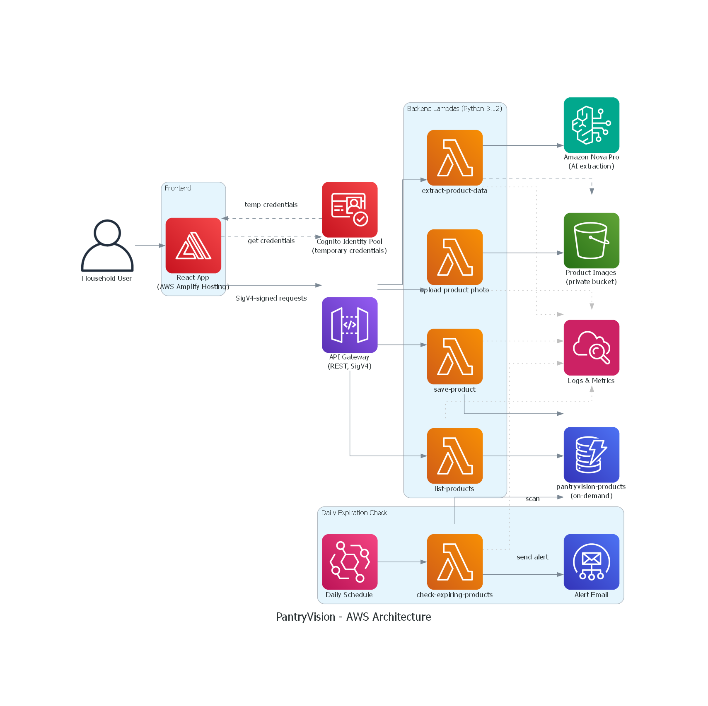

<a id="top"></a>
# 🥫 PantryVision

A serverless web application for household inventory management. Upload a photo of a product, and a vision AI model extracts the name, brand, presentation, and expiration date. Confirm the data, and the system saves it to your personal inventory with expiration and low-stock alerts.

## Table of Contents

- [🧩 Problem](#problem)
- [✨ Features](#features)
- [🏗️ Architecture](#architecture)
- [🛠️ Tech Stack](#tech-stack)
- [🛠️ Built With](#built-with)
- [📁 Project Structure](#project-structure)
- [🚀 Getting Started](#getting-started)
- [📋 AWS CLI Reference & Deployment Flow](#aws-cli-reference)
- [🗂️ Internal Documentation (.kiro/)](#internal-documentation)
- [🔒 Security](#security)
- [☁️ AWS Well-Architected Alignment](#aws-well-architected-alignment)
- [🏆 About This Project](#about-this-project)
- [📄 License](#license)

<a id="problem"></a>
## 🧩 Problem

There is no record of what was purchased, when, and when it expires. This leads to waste from expired products and duplicate or late purchases.

<p align="right"><a href="#top">⬆️ Back to top</a></p>

<a id="features"></a>
## ✨ Features

- **Photo Upload** — Select or capture a product image (JPEG, PNG, WebP, max 5 MB)
- **AI Data Extraction** — Amazon Bedrock (Amazon Nova Pro) extracts product name, brand, presentation, and expiration date
- **Manual Fallback** — If AI cannot read the data, the user can enter it manually
- **Review & Confirm** — Editable form with confidence indicators before saving
- **Inventory Dashboard** — View, filter (Expired / Expiring Soon / Good), and browse saved products with images
- **Expiration Alerts** — Daily automated email (Amazon EventBridge + SES) listing products expiring within 7 days or already expired, with a clean HTML summary
  - *Note: Amazon SES operates in sandbox mode for this demo (the default for new AWS accounts), which restricts delivery to pre-verified addresses only. The feature is fully functional and tested end-to-end — see the demo video for a live example of the alert email. In production, SES production access would be requested to enable delivery to any recipient.*

<p align="right"><a href="#top">⬆️ Back to top</a></p>

<a id="architecture"></a>
## 🏗️ Architecture

PantryVision is built entirely on AWS using a 100% serverless, pay-per-use architecture.

```
┌─────────────┐     ┌──────────────────┐
│   React     │────▶│ Cognito Identity │
│  (Frontend) │     │      Pool        │
└─────────────┘     └──────────────────┘
       │                     │
       │ SigV4-signed        │ temporary
       │ requests            │ credentials
       ▼                     │
┌─────────────┐     ┌─────────────┐     ┌──────────────────┐
│ API Gateway │◀────┴─────────────┴────▶│  AWS Lambda      │
│  (REST)     │                         │  (Python 3.12)   │
└─────────────┘                         └──────────────────┘
                                               │       │
                                               ▼       ▼
                                         ┌─────────┐ ┌──────────┐
                                         │   S3    │ │ Bedrock  │
                                         │ (Images)│ │ (AI)     │
                                         └─────────┘ └──────────┘
                                               │
                                               ▼
                                         ┌──────────┐
                                         │ DynamoDB │
                                         │(Inventory│
                                         └──────────┘
```



Requests to API Gateway are signed with AWS Signature V4 using temporary
credentials obtained from an Amazon Cognito Identity Pool (unauthenticated
access — no login required).

### AWS Services Used

| Service | Purpose |
|---------|---------|
| AWS Amplify Hosting | Frontend hosting |
| AWS Lambda | Backend functions (Python 3.12) |
| Amazon API Gateway | REST API endpoints |
| Amazon DynamoDB | Product inventory database (on-demand) |
| Amazon S3 | Private image storage |
| Amazon Bedrock | AI vision model for data extraction |
| Amazon EventBridge | Daily cron for alerts |
| Amazon SES | Email notifications |
| Amazon CloudWatch | Monitoring and logging |
| Amazon Cognito | Identity Pool for temporary, scoped AWS credentials (SigV4 request signing) |

<p align="right"><a href="#top">⬆️ Back to top</a></p>

<a id="tech-stack"></a>
## 🛠️ Tech Stack

| Layer | Technology |
|-------|-----------|
| Frontend | React, TypeScript, Vite |
| Backend | Python 3.12, boto3 |
| Database | Amazon DynamoDB (on-demand) |
| AI Model | Amazon Bedrock (Amazon Nova Pro) |
| Storage | Amazon S3 (private) |
| Infrastructure | CloudFormation |

<p align="right"><a href="#top">⬆️ Back to top</a></p>

<a id="built-with"></a>
## 🛠️ Built With

[](https://aws.amazon.com/)
[](https://aws.amazon.com/bedrock/)
[](https://aws.amazon.com/lambda/)
[](https://aws.amazon.com/dynamodb/)
[](https://aws.amazon.com/s3/)
[](https://aws.amazon.com/amplify/)
[](https://kiro.dev/)
[](https://www.python.org/)
[](https://react.dev/)
[](https://www.typescriptlang.org/)
[](https://vitejs.dev/)
[](https://opensource.org/licenses/MIT)

<p align="right"><a href="#top">⬆️ Back to top</a></p>

<a id="project-structure"></a>
## 📁 Project Structure

```
/frontend   → React app (TypeScript, Vite)
/backend    → Lambda functions (Python 3.12)
/infra      → CloudFormation templates
```

<p align="right"><a href="#top">⬆️ Back to top</a></p>

<a id="getting-started"></a>
## 🚀 Getting Started

### Prerequisites

- Node.js 18+
- Python 3.12
- AWS CLI v2 (configured with credentials)
- An AWS account with Amazon Bedrock model access enabled

### Frontend (local development)

```bash
cd frontend
cp .env.example .env.local
# Edit .env.local with your API Gateway URLs
npm install
npm run dev
```

### Backend (tests)

```bash
cd backend/extract-product-data
pip install -r requirements.txt
pytest
```

### Deployment

Infrastructure is managed as CloudFormation templates in `/infra`. Deploy in order:

1. `infra/s3-bucket.yaml` — S3 bucket
2. `infra/dynamodb-products.yaml` — DynamoDB products table
3. `infra/lambda-upload.yaml` — Upload Lambda + API Gateway
4. `infra/lambda-extract.yaml` — Extraction Lambda + API Gateway
5. `infra/lambda-save-product.yaml` — Save Product Lambda + API Gateway
6. `infra/lambda-list-products.yaml` — List Products Lambda + API Gateway
7. `infra/cognito-identity-pool.yaml` — Cognito Identity Pool (deployed last, needs the 4 API Gateway IDs as parameters)

```bash
aws cloudformation deploy --template-file infra/s3-bucket.yaml --stack-name pantryvision-s3-bucket --region <AWS_REGION>
aws cloudformation deploy --template-file infra/dynamodb-products.yaml --stack-name pantryvision-dynamodb --region <AWS_REGION>
aws cloudformation deploy --template-file infra/lambda-upload.yaml --stack-name pantryvision-lambda-upload --capabilities CAPABILITY_NAMED_IAM --region <AWS_REGION>
aws cloudformation deploy --template-file infra/lambda-extract.yaml --stack-name pantryvision-lambda-extract --capabilities CAPABILITY_NAMED_IAM --region <AWS_REGION>
aws cloudformation deploy --template-file infra/lambda-save-product.yaml --stack-name pantryvision-lambda-save --capabilities CAPABILITY_NAMED_IAM --region <AWS_REGION>
aws cloudformation deploy --template-file infra/lambda-list-products.yaml --stack-name pantryvision-lambda-list --capabilities CAPABILITY_NAMED_IAM --region <AWS_REGION>
aws cloudformation deploy --template-file infra/cognito-identity-pool.yaml --stack-name pantryvision-cognito-identity --capabilities CAPABILITY_NAMED_IAM --region <AWS_REGION> --parameter-overrides UploadApiId=<UPLOAD_API_ID> ExtractApiId=<EXTRACT_API_ID> SaveApiId=<SAVE_API_ID> ListApiId=<LIST_API_ID>
```

### Environment Variables

#### Frontend (`frontend/.env.local`)

```
VITE_API_ENDPOINT=<API_GATEWAY_UPLOAD_URL>
VITE_EXTRACT_API_ENDPOINT=<API_GATEWAY_EXTRACT_URL>
VITE_SAVE_API_ENDPOINT=<API_GATEWAY_SAVE_URL>
VITE_LIST_API_ENDPOINT=<API_GATEWAY_LIST_URL>
VITE_AWS_REGION=<AWS_REGION>
VITE_COGNITO_IDENTITY_POOL_ID=<COGNITO_IDENTITY_POOL_ID>
```

#### Backend (set by CloudFormation)

| Variable | Description |
|----------|-------------|
| `BUCKET_NAME` | S3 bucket for product images |
| `BEDROCK_MODEL_ID` | Bedrock model identifier |
| `BEDROCK_TIMEOUT` | Timeout in seconds for AI invocation |
| `TABLE_NAME` | DynamoDB table for product inventory |

<p align="right"><a href="#top">⬆️ Back to top</a></p>

<a id="aws-cli-reference"></a>
## 📋 AWS CLI Reference & Deployment Flow

Quick reference for the AWS CLI commands used most often while building and operating PantryVision.

### Most-used AWS CLI commands

| No. | Command / Action | Action / Description |
|-----|-------------------|------------------------|
| 1 | `aws cloudformation deploy` | Deploys or updates a CloudFormation stack (Lambdas, IAM roles, API Gateway, EventBridge, Cognito) |
| 2 | `aws cloudformation describe-stacks` | Checks a stack's status (e.g. `CREATE_COMPLETE`) |
| 3 | `aws s3 cp` | Uploads a packaged Lambda `.zip` to the deployment S3 bucket |
| 4 | `aws lambda update-function-code` | Updates a deployed Lambda's code directly, without re-running the full CloudFormation stack |
| 5 | `aws lambda invoke` | Manually invokes a Lambda (e.g. testing `check-expiring-products` without waiting for its daily schedule) |
| 6 | `aws lambda get-function` | Checks a Lambda's status (`LastUpdateStatus`, runtime, handler) |
| 7 | `aws logs tail` | Streams CloudWatch Logs in real time (e.g. confirming the `run_summary` log after invoking a Lambda) |
| 8 | `aws ses verify-email-identity` | Verifies an email address as an SES identity (required in sandbox mode) |
| 9 | `aws ses get-identity-verification-attributes` | Confirms whether an SES identity finished verification |
| 10 | `aws amplify list-apps` / `list-branches` / `list-jobs` | Queries Amplify Hosting apps, branches, and build jobs (checking auto-deploys) |
| 11 | `aws sts get-caller-identity` | Confirms the active AWS account/role in the current CLI session (good practice before deploying) |
| 12 | `aws configure` | Sets up the CLI's default credentials and region |

### Deployment flow: `git push` → Amplify auto-deploy

| Step | Command / Action | What happens |
|------|-------------------|--------------|
| 1 | `git add <files>` | Stage only the relevant files for the change (never a blind `git add .`) |
| 2 | `git commit -m "descriptive message"` | Create the local commit with a clear message in English |
| 3 | `git push` | The commit is pushed to the `main` branch on GitHub |
| 4 | *(automatic)* Amplify detects the push | AWS Amplify Hosting has a webhook connected to the repo — any push to `main` triggers it, no manual step needed |
| 5 | *(automatic)* Amplify runs the build | Runs `npm run build` inside `/frontend` (per the monorepo config in Amplify) |
| 6 | *(automatic)* Amplify deploys the new version | On a successful build, the new version goes live at `https://main.<app-id>.amplifyapp.com` in ~60-90 seconds |
| 7 | `aws amplify list-jobs --app-id <ID> --branch-name main` | *(Optional)* Check the latest build's status (`SUCCEED`/`FAILED`) from the CLI without opening the console |
| 8 | Manual verification in the browser/phone | Open the Amplify URL to visually confirm the change reached production |

**Key point**: steps 4-6 are fully automatic — Amplify Hosting watches the GitHub repo's `main` branch, so no AWS CLI command directly triggers the deployment; it simply happens as a consequence of the `git push`.

<p align="right"><a href="#top">⬆️ Back to top</a></p>

<a id="internal-documentation"></a>
## 🗂️ Internal Documentation (.kiro/)

PantryVision was built using [Kiro](https://kiro.dev/)'s spec-driven workflow. Every feature went through a `requirements.md → design.md → tasks.md` cycle before implementation, and project-wide conventions are encoded as steering files so the AI agent stayed consistent across the whole build. This internal documentation lives in `.kiro/` and is part of the repo.

```
.kiro/
├── specs/
│   ├── upload-product-photo/       -- Photo capture, validation, presigned S3 upload
│   ├── ai-data-extraction/         -- Amazon Bedrock (Nova Pro) extraction pipeline
│   ├── save-product-inventory/     -- Save confirmed product data to DynamoDB
│   ├── inventory-dashboard/        -- List, filter, and display saved products
│   ├── frontend-ui-redesign/       -- Visual redesign, i18n (ES/EN), UX polish
│   └── expiration-alerts/          -- Daily EventBridge + SES expiration email
│       (each spec: requirements.md, design.md, tasks.md)
│
└── steering/
    ├── product.md              -- Product context, target audience, key objectives
    ├── tech.md                 -- Fixed tech stack & architecture rules (serverless-first, AI never blocks, no hardcoded secrets)
    ├── structure.md            -- Project layout and code conventions
    ├── aws.md                  -- Approved AWS services & cost optimization guidelines
    ├── security.md             -- Secrets management & sensitive data handling
    ├── best-practices.md       -- AWS Well-Architected best practices
    └── repository.md           -- Pre-commit checklist & repo exclusion rules
```

Six features, six specs — each documenting the acceptance criteria (EARS format), the technical design, and the task breakdown that was actually executed. This kept the AI agent's context consistent from the first upload flow all the way to the final UI redesign, without re-explaining the project's rules in every conversation.

<p align="right"><a href="#top">⬆️ Back to top</a></p>

<a id="security"></a>
## 🔒 Security

- All S3 buckets are private — access only via presigned URLs
- API endpoints use AWS IAM authorization
- No credentials are hardcoded in source code
- Data encrypted at rest and in transit
- Principle of Least Privilege applied to all IAM roles
- Anonymous visitors receive short-lived, scoped AWS credentials via a Cognito Identity Pool (no long-term keys exposed in frontend code)

<p align="right"><a href="#top">⬆️ Back to top</a></p>

<a id="aws-well-architected-alignment"></a>
## ☁️ AWS Well-Architected Alignment

| Pillar | How PantryVision applies it |
|--------|----------------------------|
| Security | Private S3 buckets, IAM authorization on all endpoints, least privilege IAM roles, encryption at rest and in transit |
| Cost Optimization | Serverless pay-per-use, DynamoDB on-demand, image resized to 1024px before Bedrock invocation, maxTokens capped at 400 |
| Reliability | AI never blocks the user flow — manual fallback always available, graceful error handling on all AWS service calls |
| Performance Efficiency | Image downscaled before AI processing, Lambda timeouts configured per function, Bedrock timeout at 30s |
| Operational Excellence | Infrastructure as code (CloudFormation), structured CloudWatch logging with duration and token metrics |
| Sustainability | Serverless scales to zero (no idle resources), image resized before AI to reduce compute, direct-to-S3 uploads bypass Lambda, capped token output |

<p align="right"><a href="#top">⬆️ Back to top</a></p>

<a id="about-this-project"></a>
## 🏆 About This Project

PantryVision was developed as part of the Kiro Hackathon, organized by
Código Facilito in collaboration with AWS and Kiro AI.

### Highlights

- 🚀 Built during an intensive 6-day development sprint
- 👩‍💻 Designed and implemented individually
- ☁️ Built using AWS serverless services
- 🤖 Uses Amazon Bedrock to extract product information from images
- 📱 Responsive web application deployed on AWS Amplify
- 🎯 Created to help reduce household food waste by tracking product expiration dates

### 🤖 About Kiro

This project was built using [Kiro](https://kiro.dev/), an AI-powered
development environment (IDE) that helped design, implement, and document
PantryVision through a structured, spec-driven workflow.

| Aspect | Description |
|--------|--------------|
| **What is Kiro** | An agentic AI IDE (built on VS Code) that pairs a developer with an AI agent to plan, write, and verify code — not just autocomplete it. |
| **Core Workflow** | Spec-driven development: requirements → design → tasks → implementation, so features are planned and reviewed before code is written. |
| **Vibe Mode** | Conversational, exploratory coding for quick iterations, prototyping, and small fixes without a formal spec. |
| **Spec Mode** | Structured workflow that generates `requirements.md`, `design.md`, and `tasks.md` for a feature, keeping documentation and code in sync. |
| **Steering Files** | Project-level context files (`.kiro/steering/`) that encode conventions, tech stack decisions, and product context so the agent stays consistent across sessions. |
| **Agent Hooks** | Automations that trigger agent actions on events (file save, task completion, etc.), used to keep quality checks consistent. |
| **Property-Based Testing** | Kiro encourages defining correctness properties and validating them with generative tests, not just example-based unit tests. |
| **Used in PantryVision for** | Planning features (photo upload, AI extraction, inventory dashboard, expiration alerts), generating and refactoring both backend (Python) and frontend (React/TypeScript) code, writing tests, and maintaining this documentation. |

This project was created as a hackathon MVP and represents a functional
proof of concept. Future improvements may include authentication, push
notifications, barcode scanning, and advanced inventory analytics.

<p align="right"><a href="#top">⬆️ Back to top</a></p>

<a id="license"></a>
## 📄 License

MIT

<p align="right"><a href="#top">⬆️ Back to top</a></p>
